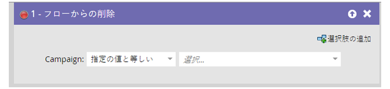
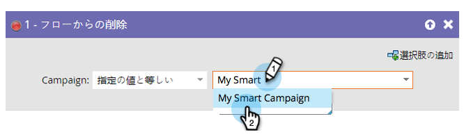

# フローから削除{#remove-from-flow}

「アラートの送信」を使用して、販売担当者にホット・見込み客の呼び出しを促すスマートなキャンペーン・フローがあるとします。 担当者が通話を行うまで、毎日1つのメッセージが送信されます。 見込み客に連絡してそれ以上のアラートを停止した後は、トリガーキャンペーンで「フローから削除」を使用できます。 人にとってスマートなキャンペーンエジェクターシートのようです

>[!NOTE]
>
>これは通常、キャンペーンフローの待機ステップに座っている人に影響を与えます。

## 概要{#overview}

**フロー**&#x200B;から削除フローステップを使用すると、キャンペーンのフローからユーザーを削除できます。

## 使用法{#usage}

ユーザーを削除するスマートキャンペーンを見つけて選択します。

>[!NOTE]
>
>特定のスマートキャンペーンを選択するか、**キャンペーン**&#x200B;ドロップダウンで「このキャンペーン」を選択して、物理的にその時点のキャンペーンを選択します。

>[!NOTE]
>
>**Reminder**
>
>この機能は、スマートキャンペーンのフローステップ内で使用することを目的としています。

