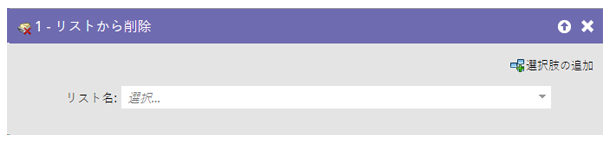
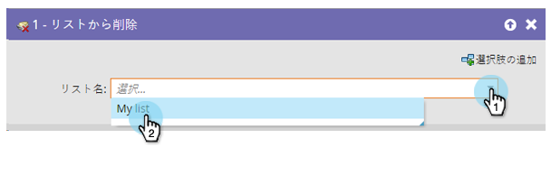

# リストから削除 {#remove-from-list}

「[リストに追加](/help/marketo/product-docs/core-marketo-concepts/smart-campaigns/flow-actions/add-to-list.md){target="_blank"}」できるなら、リストから人物を削除する方法も必要です。

1. ユーザーを削除するリストを検索して選択します。

   

これで完了です。
