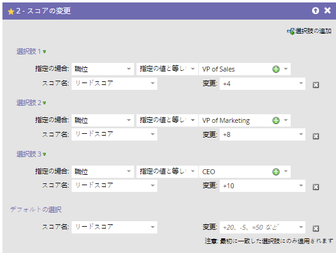
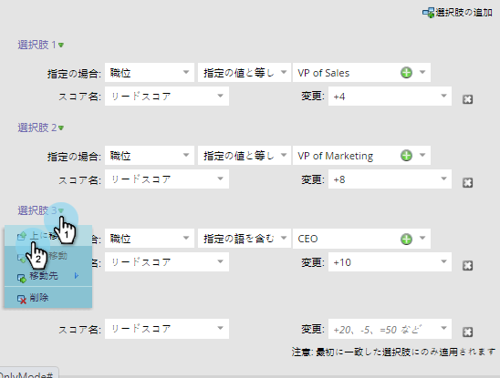
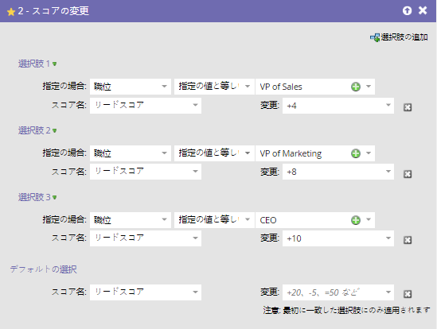
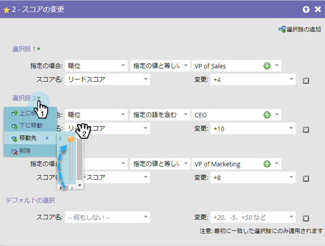

# フローステップ{#reorder-add-choice-in-a-flow-step}の「追加選択」の順序を変更

最初のマッチングの選択しか人に当てはまらないので、注文は重要です。 フローステップで設定した条件の順序を変更するには、次の手順を実行します。

1. 選択の順序を変更するフローステップを見つけます。

   

1. 選択肢3を選択肢2の上に移動します。 **選択3**&#x200B;をクリックし、**上へ移動**&#x200B;をクリックします。

   >[!NOTE]
   >
   >順序を変更する場合、**上へ移動**、**下へ移動**、**移動**&#x200B;のいずれかを実行できます。

    

1. 選択肢が多く、1つのレベルを上下に移動する必要がある場合は、この代替方法を使用して時間を節約できます。 移動する選択肢をクリックし、**移動先**&#x200B;の下で、スライダを選択肢の移動先にドラッグします。

   

いい仕事！ これで、選択項目を1増分で上下に移動する方法を理解できました。 それだ！ フローステップの選択の順序を再構成するのは、非常に簡単です。
