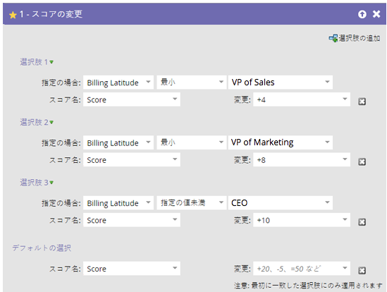
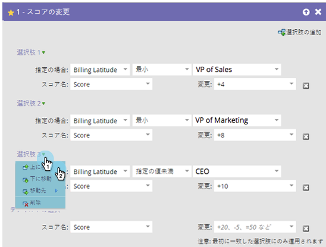
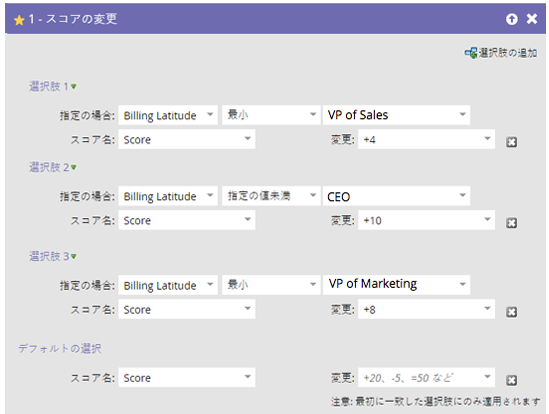
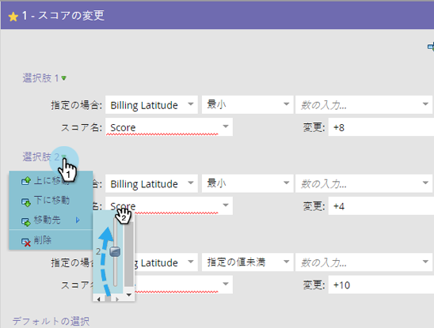

# フローステップの「選択肢を追加」の並べ替え {#reorder-add-choice-in-a-flow-step}

最初に一致した選択肢は人物にのみ当てはまるので、順序は重要です。 フローステップで設定された条件の順序を変更する場合は、次の手順に従います。

1. 選択の順序を変更するフローステップを見つけます。

   

1. この例では、選択肢 3 を選択肢 2 の上に移動しましょう。 **[!UICONTROL 選択肢 3]** をクリック、次に、「**[!UICONTROL 上に移動]**」をクリックします。

   

   >[!NOTE]
   >
   >並べ替え時には、「**[!UICONTROL 上に移動]**」、「**[!UICONTROL 下に移動]**」、「**[!UICONTROL 移動先]**」の操作が可能です。

   1つの増分で選択を上下に移動できます。

   

**オプションの手順**：多くの選択肢があり、複数のレベルを上または下に移動する必要がある場合は、次の代替方法を使用すると時間を節約できます。 移動する選択肢をクリックし、「**[!UICONTROL 移動先]**」で、選択肢を移動する位置までスライダーをドラッグします。

