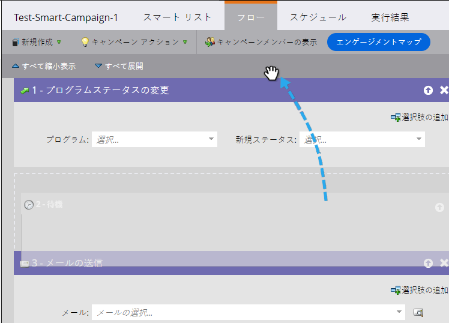

# スマートキャンペーンでのフローステップの並べ替え {#reorder-the-flow-steps-in-a-smart-campaign}

フローステップは、上から下に実行されます。必要に応じてフローステップを並べ替える方法を次に示します。

>[!PREREQUISITES]
>
>[スマートキャンペーンへのフローステップの追加](/help/marketo/product-docs/core-marketo-concepts/smart-campaigns/flow-actions/add-a-flow-step-to-a-smart-campaign.md)

1. スマートキャンペーン内 **[!UICONTROL 流量]** 「 」タブで、フローステップを目的の場所にドラッグ&amp;ドロップするだけです。

>[!NOTE]
>
>フローステップは、フローで表示されている順番に実行されます。
