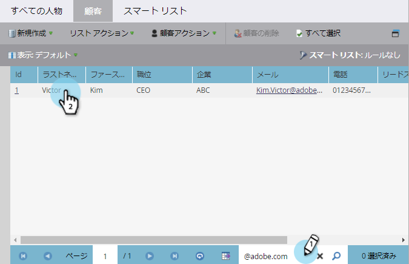
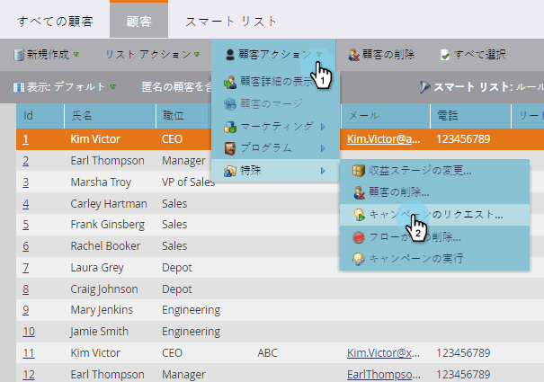
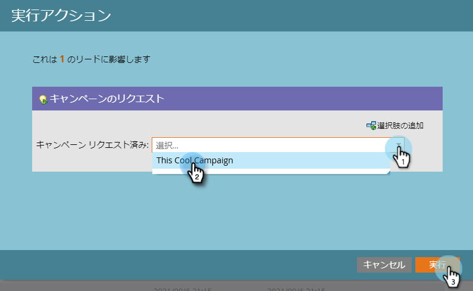
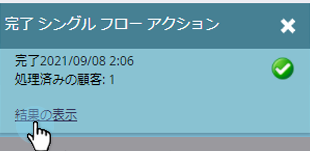

# 要求キャンペーン{#request-campaign}

**リクエストキャンペーン**&#x200B;の単一フローステップを使用して、特定のキャンペーンにユーザーを配置できます。

>[!NOTE]
>
>ユーザーを配置するキャンペーンはアクティブで、** [キャンペーンが要求済み](../../../../product-docs/core-marketo-concepts/smart-campaigns/using-smart-campaigns/setting-up-a-trigger-smart-campaign-for-sales-using-campaign-is-requested.md)**トリガーである必要があります。

1. **データベース**&#x200B;で、目的のユーザーを探して選択します。

   

1. 「**個人アクション**」をクリックし、「**特別な**」の上にマウスポインターを置いて、「**キャンペーンをリクエスト**」を選択します。

   

1. ユーザーを配置するキャンペーンを選択し、「**今すぐ実行**」をクリックします。

   

1. 画面の右上に、いつ表示されるかがわかります。 「**表示結果**」をクリックします。

   

   これで、ユーザーは「要求された」キャンペーンに入ります。

   

   すごい仕事！

>[!TIP]
>
>**キャンペーンは、要求済み**&#x200B;トリガーまたはフィルターを使用して、このフロー手順の影響を受ける人を探します。

