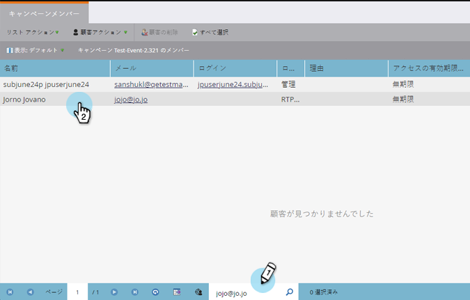
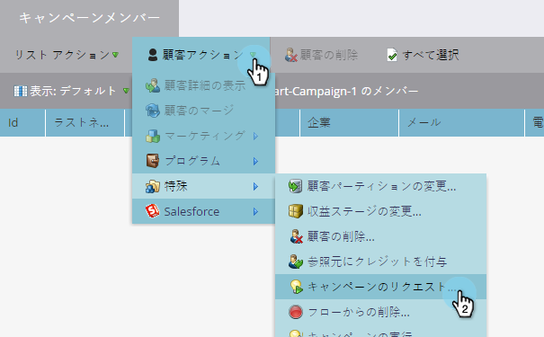
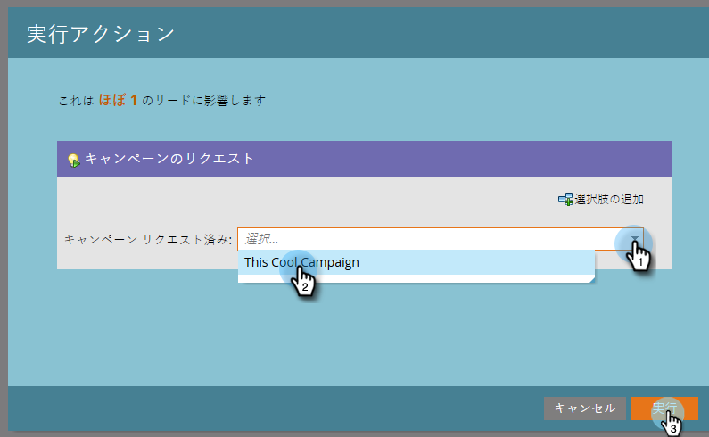
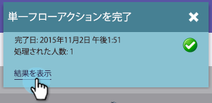
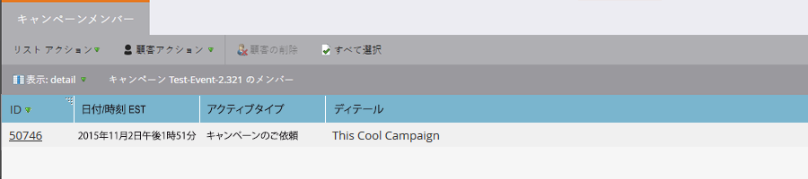

# キャンペーンのリクエスト {#request-campaign}

特定のキャンペーンに人物を配置するには、「[!UICONTROL キャンペーンのリクエスト]」単一フローステップを使用します。

>[!NOTE]
>
>人物を配置するキャンペーンはアクティブで、[&#x200B; キャンペーンがリクエスト済み](/help/marketo/product-docs/core-marketo-concepts/smart-campaigns/using-smart-campaigns/setting-up-a-trigger-smart-campaign-for-sales-using-campaign-is-requested.md){target="_blank"}のトリガーを持っている必要があります。

1. **[!UICONTROL データベース]**&#x200B;で、目的の人物を検索して選択します。

   

1. 「**[!UICONTROL 人物のアクション]**」をクリックし、「**[!UICONTROL 特殊]**」にポインタを合わせ、「**[!UICONTROL キャンペーンのリクエスト]**」を選択します。

   

1. 人物を配置するキャンペーンを選択し、「**[!UICONTROL 今すぐ実行]**」をクリックします。

   

1. 画面の右上に、完了が表示されます。 「**[!UICONTROL 結果を表示]**」をクリックします。

   

   キャンペーンのリクエストに人物が追加されました。

   

>[!TIP]
>
>「[!UICONTROL キャンペーンをリクエスト]」トリガーまたはフィルターを使用して、このフローステップの影響を受ける人物を検索します。
