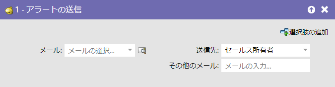
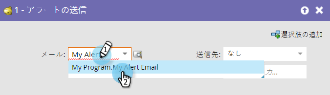
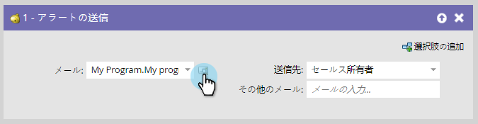
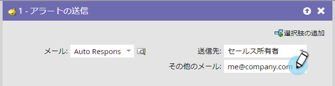

# アラートの送信{#send-alert}

## 概要{#overview}

Marketorは、販売所有者、パートナー、その他の人に、個人情報を含む電子メールアラートを送信できます。 **警告**&#x200B;の送信のフローステップを使用します。

## 使用法{#usage}

1. 送信する電子メールを探して選択します。

   

   >[!NOTE]
   >
   >電子メールアラートには、すべてのヘッダー情報が含まれ、**承認済み**&#x200B;状態にある必要があります。

1. プレビューアイコンをクリックして、正しい電子メールが選択されていることを確認できます。

   

   >[!NOTE]
   >
   >電子メールには、**警告情報**&#x200B;の送信トークンを必ず使用してください。

1. アラート受信者を選択します。 「販売所有者」または「アカウント所有者」を選択できます。

   

1. 必要に応じて、必要に応じて、他の電子メールアドレスを追加します（コンマまたはセミコロンで区切ります）。

   

   >[!TIP]
   >
   >トリガーキャンペーンでは、値が有効な電子メールアドレスである限り、**「他の電子メール**&#x200B;へ」（`{{lead.Territory Owner}}`、`{{my.Alert Recipient}}`など）でトークンを使用できます。 **To Other Emails**&#x200B;内のトークンは、バッチキャンペーンでは動作しません。

それだ！ これで、**アラートの送信**&#x200B;フローステップの使用方法がわかりました。

>[!MORELIKETHIS]
>
>[電子メールの作成](/help/marketo/product-docs/email-marketing/general/creating-an-email/create-an-email.md)
