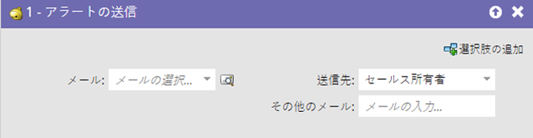
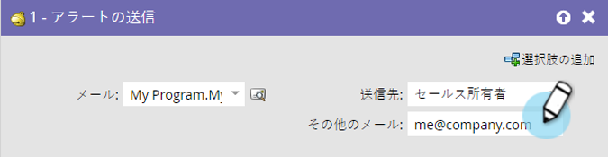

# アラートの送信 {#send-alert}

Marketo Engage は、人物情報を記載したメールアラート（セールス所有者、パートナー、またはその他の人）を誰にでも送信できます。「[!UICONTROL アラートの送信]」フローステップを使用します。

1. 送信するメールを探して選択します。

   

   >[!NOTE]
   >
   >メールアラートには、すべてのヘッダー情報が含まれ、「**[!UICONTROL 承認済み]**」ステートである必要があります。

1. 「プレビュー」アイコンをクリックして、正しいメールを選択していることを確認できます。

   

   >[!NOTE]
   >
   >必ず「[!UICONTROL アラート情報の送信]」トークンをメールに追加するようにします。

1. アラート受信者を選択します。「[!UICONTROL セールス所有者]」または「[!UICONTROL アカウント所有者]」を選択できます。

   

1. 必要に応じて、他のメールアドレスを追加します（コンマまたはセミコロンで区切ります）。

   

   >[!TIP]
   >
   >トリガーキャンペーンでは、値が有効なメールアドレスである限り、`{{lead.Territory Owner}}` や `{{my.Alert Recipient}}` といった「**[!UICONTROL 他のメールへ]**」トークンを使用できます。「**[!UICONTROL 他のメールへ]**」のトークンはバッチキャンペーンでは機能しません。

>[!MORELIKETHIS]
>
>[メールの作成](/help/marketo/product-docs/email-marketing/general/creating-an-email/create-an-email.md){target="_blank"}
