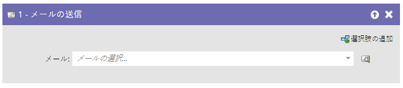
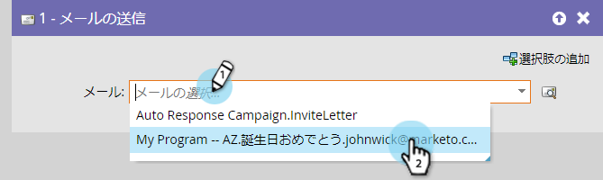
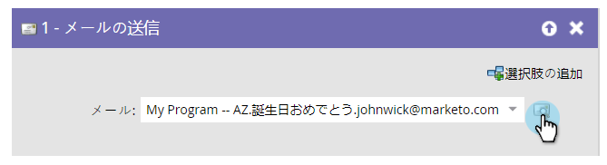

# 電子メールの送信{#send-email}

## 概要{#overview}

「**電子メールの送信**flow」ステップは、キャンペーンの一部として、またはユーザーに電子メールを送信する単一のフローステップとして使用できます。

## 使用法{#usage}

選択した電子メールは、フローステップから直接プレビューできます。

1. 送信する電子メールを探して選択します。

   

   >[!NOTE]
   >
   >**Reminder**
   >
   >
   >フローステップで電子メールを選択する場合は、電子メールを承認する必要があります。

1. プレビューアイコンをクリックすると、現在選択されている電子メールが表示されます。

   

   新しいタブ/ウィンドウが開き、電子メールが表示されます。

