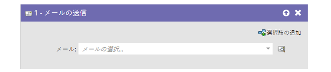
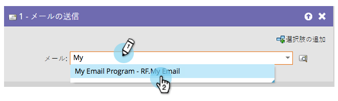
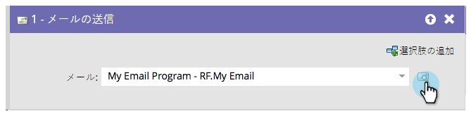

# メールの送信 {#send-email}

「[!UICONTROL  メールを送信 ]」フローステップは、キャンペーンの一部として、または人物にメールを送信する単一のフローステップとして使用できます。

フローステップから選択したメールを直接プレビューできます。

1. 送信するメールを探して選択します。

   

   >[!NOTE]
   >
   >フローステップ内でメールを選択する場合、あらかじめメールを承認しておく必要があります。

1. プレビューアイコンをクリックして、現在選択されているメールを確認します。

   

新しいタブまたはウィンドウが開き、メールを確認できます。
