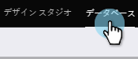
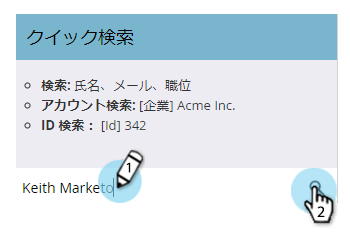
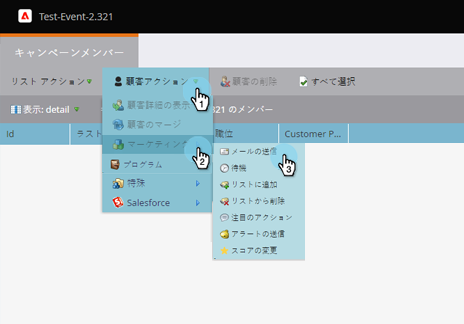

# 「個人詳細」ページからの単一フロー・アクション {#single-flow-actions-from-person-detail-page}

スマートリスト内から単一のフローアクションを実行する以外に、個人の詳細ページで直接実行することもできます。

1. 「**データベース**」をクリックします。

   

1. 目的の人を見つけます。

   

1. **個人アクション**&#x200B;ドロップダウンをクリックし、目的のフローステップを選択します。 この例では、[Send Email](/help/marketo/product-docs/core-marketo-concepts/smart-campaigns/flow-actions/send-email.md)を使用します。

   

1. 目的の電子メールを選択し、「**今すぐ実行**」をクリックします。

   

>[!NOTE]
>
>インスタンスにワークスペース/パーティションが含まれ、ワークスペースに関連付けられたページ/アセットからではなく、直接（リンクを介して）個人の詳細ページに移動する場合は、手順4でワークスペースも選択する必要があります。
