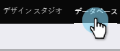
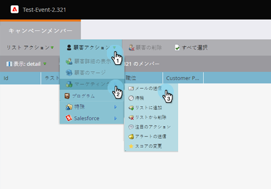

# 人物の詳細ページからの単一フローアクション {#single-flow-actions-from-person-detail-page}

スマートリスト内から単一のフローアクションを実行する以外に、人物の詳細ページで直接実行することもできます。

1. 「**[!UICONTROL データベース]**」をクリックします。

   

1. 目的の人物を見つけます。

   

1. 「**[!UICONTROL 人物のアクション]**」ドロップダウンリストから、目的のフローステップを選択します。 この例では、「[メールの送信](/help/marketo/product-docs/core-marketo-concepts/smart-campaigns/flow-actions/send-email.md){target="_blank"}」を使用します。

   

1. 目的のメールを選択し、「**[!UICONTROL 実行]**」をクリックします。

   

>[!NOTE]
>
>インスタンスにワークスペース/パーティションが含まれており、Workspaceに関連付けられたページ/アセットから取得するのではなく、直接人物の詳細ページ（リンク経由など）に移動する場合は、手順4でWorkspaceも選択する必要があります。
