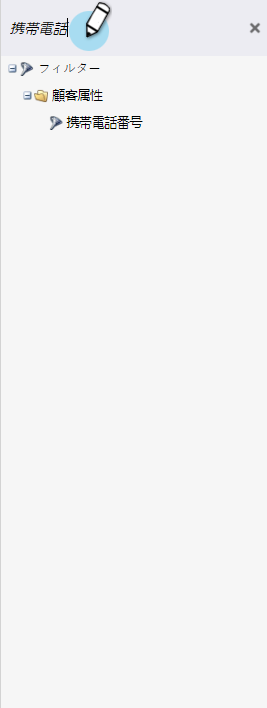
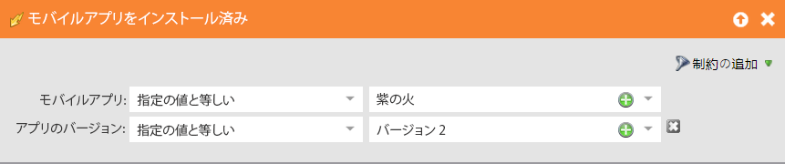
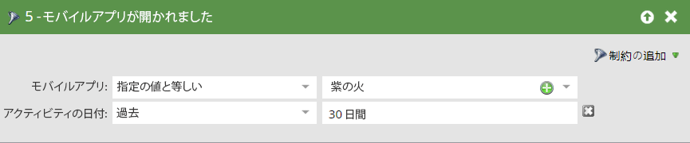
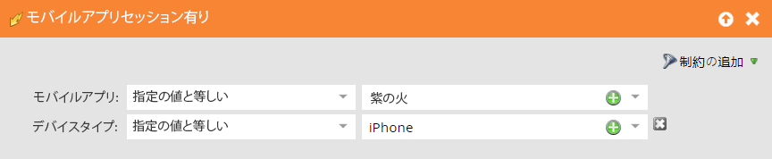
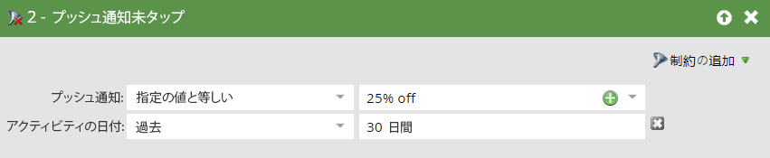
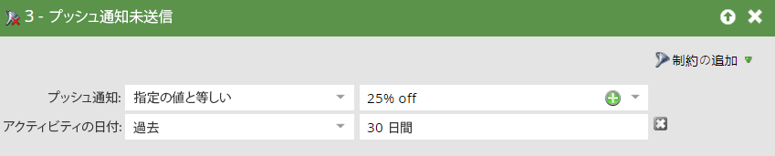

# モバイルスマートキャンペーンのトリガーとフィルター {#triggers-and-filters-for-mobile-smart-campaigns}

モバイルアプリスマートキャンペーンのトリガーとフィルターを設定できます。

ほとんどのアクティビティには、トリガー、フィルター、非アクティブフィルターがあります。非アクティブフィルターを使用して、プッシュ通知のタップなど、発生&#x200B;_しなかった_&#x200B;アクションを追跡します。

* モバイルアプリがインストールされる／された
* モバイルアプリが開かれる／開かれた
* モバイルアプリアクティビティあり／あった
* モバイルアプリセッションあり／あった
* モバイルプッシュ通知タップ／タップした

次のアクティビティにはフィルターのみがあります。

* プッシュ通知送信済み - フィルターおよび非アクティブフィルター

右側のパネルで「モバイルアプリ」を検索して、すべてのモバイルアプリのトリガーとフィルターを表示します。

## 制約 {#constraints}

制約とトリガーおよびフィルターを使用して、データをさらに並べ替えます。

「プッシュ通知が送信された」を除くすべてのトリガーおよびフィルターには、次の 2 つの標準制約が含まれています。

* デバイスタイプ - [!DNL iPod]、iPhone、[!DNL iPhone 6 Plus]、[!DNL iPad mini]、iPad、Android スマートフォン、Android タブレット、不明（これはプリセットリストです）

* プラットフォーム - iPhone または Android

一部のトリガーおよびフィルターには、次のような追加の制約があります。

* アプリのバージョン - 最新バージョンではない人物をターゲットにする方法です。例えば、最新のアプリバージョンが 2.0 の場合、それを使用して、アプリバージョン 2.0 に登録されていないユーザーを検索できます

* インストールソース - 現在、唯一のオプションは API です。

* ロケール - デバイス上の設定。

* モバイルアプリ - 特定のアプリの名前。複数のアプリがある場合に特定するのに便利です。

* プラットフォームのバージョン - OS のバージョン。

* セッションの長さ（秒） - アプリが前面に表示されているときのセッション時間

* プッシュ有効 - **True** は、プッシュ通知を送信できることを意味します。**False** は送信できないという意味です。例えば、プッシュ通知の受信をオプトアウトされた場合が考えられます。

## トリガーとフィルター {#triggers-and-filters}

**モバイルアプリあり**

このフィルターを使用して、アプリをインストールしたことのあるすべての人物を見つけ出します。これはフィルターとしてのみ使用できます。

>[!NOTE]
>
>Marketo はアプリのアンインストールをトラックしないので、フィルターは現在のインストールと以前のインストールの両方を検索します。

**制約**：デバイスタイプ、プラットフォーム、モバイルアプリ、モバイルアプリのバージョン、インストールソース、プッシュ有効、ロケール

>[!TIP]
>
>プッシュ通知を受信する人物のスマートリストを定義する際のベストプラクティスは、「モバイルアプリあり」を true、「プッシュ有効」を true にそれぞれ指定し、さらにモバイルアプリの名前を指定することです。

モバイルアプリがインストールされる／された

* モバイルアプリがインストールされる - トリガー

* モバイルアプリがインストールされた - フィルター

* モバイルアプリがインストールされていない - 非アクティブフィルター

**制約**：デバイスタイプ、プラットフォーム、アプリのバージョン、ロケール、インストールソース

モバイルアプリが開かれる／開かれた

* モバイルアプリが開かれる - トリガー

* モバイルアプリが開かれた - フィルター

* モバイルアプリが開かれていない - 非アクティブフィルター

**制約**：デバイスタイプとプラットフォーム

モバイルアプリアクティビティあり／あった

これらは、カスタムモバイルアクティビティをトラックする強力な方法を提供します。開発者と協力して、[Android 向け](https://experienceleague.adobe.com/ja/docs/marketo-developer/marketo/mobile/installation#how-to-install-marketo-sdk-on-android){target="_blank"}および [iOS 向け](https://experienceleague.adobe.com/ja/docs/marketo-developer/marketo/mobile/installation#install-marketo-sdk-on-ios){target="_blank"}にトラッキングを設定する必要があります。

* モバイルアプリアクティビティあり - トリガー

* モバイルアプリアクティビティがあった - フィルター

* モバイルアプリアクティビティなし - 非アクティブフィルター

**制約** - デバイスタイプ、プラットフォーム、モバイルアプリのバージョン、ロケール、プラットフォームのバージョンに加えて、次の 5 つの追加制約があります。

* アクション - カスタムモバイルアクティビティ

* アクションタイプ - （オプション）複数のアクションの分類に使用するテキストフィールド

* アクション詳細 - （オプション）アクションに関する追加情報を提供するテキストフィールド

* アクション指標 - （オプション）アクションに関する追加情報（価格など）を提供する数値フィールド

* アクションの長さ（秒） - （オプション）ユーザーがアクションを完了するまでに要した時間を取得するために使用できる数値フィールド

アクション制約を使用すると、トリガーとフィルターを使用して、モバイルアクティビティを密接にトラックできます。

>[!NOTE]
>
>**例**
>
>_買い物_&#x200B;アクションタイプで、非常に具体的なアクションを追加の制約によって定義できます。
>
>* シャツを購入
>   * 色は赤
>   * 価格は 30 ドル
>   * 購入するまで 20 秒かかった

Marketo でのフィルターは次のようになります。

>[!NOTE]
>
>**例**
>
>同じアクションタイプで複数のアクションを設定できます。実際に、通常のショッピングエクスペリエンスには、「買い物」の下に複数の列が含まれる場合もあります。靴下も合わせて購入することを考えてみてください。
>
>| アクションのタイプ | 買い物 | 買い物 |
>|---|---|---|
>| アクション | シャツを購入 | パンツを購入 |
>| アクション詳細 | 色 | 色 |
>| アクション指標 | 価格 | 価格 |

**モバイルアプリセッションあり／あった**

* モバイルアプリセッションあり - トリガー

* モバイルアプリセッションがあった - フィルター

* モバイルアプリセッションなし - 非アクティブフィルター

**制約** - デバイスタイプ、プラットフォーム、セッションの長さ（秒）

プッシュ通知をタップ／タップした

* プッシュ通知をタップ -トリガー

* プッシュ通知をタップした - フィルター

* プッシュ通知タップなし - 非アクティブフィルター

**制約** - デバイスタイプ、プラットフォーム、モバイルアプリのバージョン、プッシュ通知、プラットフォームのバージョン

>[!TIP]
>
>「プッシュ通知タップなし」非アクティブフィルターを使用すると、最近送信したプッシュ通知をタップしなかった人物を検索して、メールでフォローアップできます。

**プッシュ通知を送信済み**：このアクティビティは、フィルターとしてのみ使用できます。

* プッシュ通知を送信済み-フィルター

* プッシュ通知送信なし - 非アクティブフィルター

**制約** - プッシュ通知とモバイルアプリ

>[!MORELIKETHIS]
>
>* [スマートリストフィルターへの制約の追加](/help/marketo/product-docs/core-marketo-concepts/smart-lists-and-static-lists/using-smart-lists/add-a-constraint-to-a-smart-list-filter.md){target="_blank"}
>* [スマートリストでの非アクティブフィルターの使用](/help/marketo/product-docs/core-marketo-concepts/smart-lists-and-static-lists/using-smart-lists/use-inactivity-filters-in-a-smart-list.md){target="_blank"}
