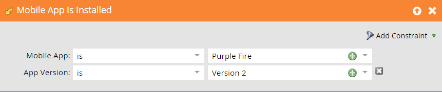

# モバイルスマートキャンペーンのトリガーとフィルター{#triggers-and-filters-for-mobile-smart-campaigns}

モバイルアプリのスマートキャンペーン用にトリガーとフィルターを設定できます。

ほとんどのアクティビティには、トリガー、フィルタ、無操作状態のフィルタがあります。 プッシュ通知をタップした場合など、*が発生しなかったアクションを追跡するには、無操作フィルターを使用します。*

* モバイルアプリがインストールされた/既に
* モバイルアプリが開かれた/開かれた
* モバイルアプリのアクティビティを持つ/持つ
* モバイルアプリセッションを有する/有効にした
* タップ/タップされたモバイルプッシュ通知

このアクティビティにはフィルターのみがあります。

* 送信されたプッシュ通知 — フィルターと無操作状態のフィルター

右側のパネルで&#x200B;**モバイルアプリ**&#x200B;を検索し、すべてのモバイルアプリトリガーとフィルターをリストします。

## 制約{#constraints}

トリガーとフィルターに制約を使用して、データをさらに細分します。

「送信済みのプッシュ通知」を除くすべてのトリガーとフィルターには、次の2つの標準制約が含まれます。

* デバイスタイプ — iPod、iPhone、iPhone 6 Plus、iPad mini、iPad、Androidスマートフォン、Androidタブレット、不明(プリセットリスト)

* プラットフォーム — iPhoneまたはAndroid

一部のトリガーおよびフィルターは、次のような追加の制約をオファーします。

* アプリのバージョン — 最新バージョンではないユーザーをターゲットする手段です。 例えば、最新バージョンのアプリが2.0の場合、それを使用して、アプリバージョン2.0以外のユーザーを検索できます

* インストールソース — 現在、唯一のオプションはAPIです

* ロケール — デバイスの設定

* モバイルアプリ — 特定のアプリの名前。 複数の

* プラットフォームのバージョン — OSのバージョン

* セッションの長さ（秒） — アプリがフォアグラウンドになったときのセッション時間

* Is Push Enabled - **True**&#x200B;は、プッシュ通知を送信できることを意味します。 **フ** ァルスというのは、無理だという意味だ。例えば、ユーザーがプッシュ通知の受信をオプトアウトした可能性があります

## トリガーとフィルター{#triggers-and-filters}

**モバイルアプリを持つ**

このフィルターを使用して、アプリをインストールしたことのあるすべてのユーザーを調べます。 これはフィルターとしてのみ使用できます。

>[!NOTE]
>
>Marketorはアプリのアンインストールを追跡しないので、フィルターでは現在のインストールと以前のインストールの両方が見つかります。

**制約**:デバイスの種類、プラットフォーム、モバイルアプリ、モバイルアプリのバージョン、デバイスの種類、インストールソース、プッシュが有効、ロケール

>[!TIP]
>
>プッシュ通知を受け取る必要のあるユーザーのスマートリストを定義する際に、「Has Mobile App = true」と「Is Push Enabled = true」という値と、モバイルアプリの名前を指定することがベストプラクティスです。

モバイルアプリがインストールされた/既に

* モバイルアプリがインストールされました —トリガー

* モバイルアプリがインストールされました — フィルター

* NOT Mobileアプリがインストールされました — 無操作状態のフィルター

**制約**:デバイスの種類、プラットフォーム、アプリのバージョン、ロケール、インストールソース

モバイルアプリが開かれた/開かれた

* モバイルアプリが開かれている —トリガー

* モバイルアプリが開かれました — フィルター

* モバイルアプリが開かれませんでした — 無操作状態のフィルター

**制約**:デバイスタイプとプラットフォーム

モバイルアプリのアクティビティを持つ/持つ

これらは、カスタムモバイルアクティビティを追跡する強力な方法を提供します。 Android](https://developers.marketo.com/documentation/mobile/installation-instructions-on-android)用に[を設定し、iOS](https://developers.marketo.com/documentation/mobile/installation-instructions-on-ios)用に[を設定するには、開発者と協力する必要があります。

* モバイルアプリアクティビティ-トリガー

* モバイルアプリアクティビティを持つ — フィルター

* モバイルアプリアクティビティがない — 無操作状態のフィルター

**制約**:デバイスのタイプとプラットフォームに加えて、5つの追加機能：

* 対応 — カスタムモバイルアクティビティ

* アクションタイプ — （オプション）複数のアクションの分類に使用するテキストフィールド

* アクションの詳細 — （オプション）アクションに関する追加情報を提供するテキストフィールド

* アクション指標 — （オプション）アクションに関する追加情報（例：price）を提供する数値フィールド

* アクションの長さ（秒） — （オプション）ユーザーがアクションを完了するまでに要した時間を取得するのに使用できる数値フィールド

Action制約を使用すると、トリガーとフィルターを使用してモバイルアクティビティを非常に詳細に追跡できます。

>[!NOTE]
>
>**例**
>
>*Shopping*&#x200B;というアクションタイプの下に、非常に特殊なアクションがあり、他の制約が定義されています。
>
>* シャツを買った
   >   * 赤い
   >   * それは30ドルかかった
   >   * 買うのに20秒かかった

Marketoでは次のようにフィルターが表示されます。

>[!NOTE]
>
>**例**
>
>同じアクションタイプで複数のアクションを設定できます。 実際、通常の買い物体験では、「Shopping」の下に複数の列が含まれる場合があります。 靴下も持って行きませんか？
>
>| アクションタイプ | 買い物 | 買い物 |
>|---|---|---|
>| アクション | 買ったシャツ | 買ったパンツ |
>| アクションの詳細 | カラー | カラー |
>| アクション指標 | 価格 | 価格 |

**モバイルアプリセッションを有する/有効にした**

* モバイルアプリセッションあり —トリガー

* モバイルアプリセッションあり — フィルター

* NOT Had Mobile App Session — 無操作状態フィルター

**制約**:デバイスタイプ、プラットフォーム、セッションの長さ（秒）

タップ/タップされたプッシュ通知

* タップのプッシュ通知 —トリガー

* タップされたプッシュ通知 — フィルタ

* 非タッププッシュ通知 — 無操作状態のフィルタ

**制約**:デバイスタイプ、プラットフォーム、モバイルアプリのバージョン、プッシュ通知、プラットフォームのバージョン

>[!TIP]
>
>最近送信されたプッシュ通知をタップしなかった人を検索し、電子メールでフォローアップできるように、「未タッププッシュ通知」無操作フィルターを使用します。

**送信済みのプッシュ** 通知このアクティビティは、フィルターとしてのみ使用できます。

* 送信されたプッシュ通知 — フィルタ

* NOT Was Sent Push Notification — 無操作状態フィルタ

**制約**:プッシュ通知とモバイルアプリ

>[!MORELIKETHIS]
>
>* [スマートリストフィルター追加の制約](/help/marketo/product-docs/core-marketo-concepts/smart-lists-and-static-lists/using-smart-lists/add-a-constraint-to-a-smart-list-filter.md)
>* [スマートリストでの無操作フィルターの使用](/help/marketo/product-docs/core-marketo-concepts/smart-lists-and-static-lists/using-smart-lists/use-inactivity-filters-in-a-smart-list.md)

