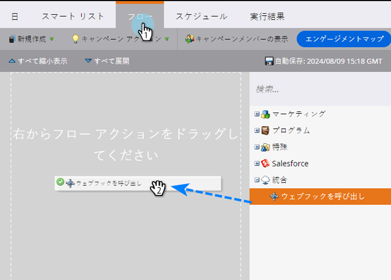
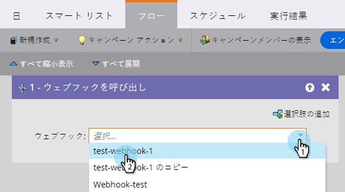
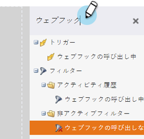

# スマートキャンペーンでの web フックの使用 {#use-a-webhook-in-a-smart-campaign}

[Web フック](https://experienceleague.adobe.com/ja/docs/marketo-developer/marketo/webhooks/webhooks){target="_blank"}を使用するには、フローアクションとして[スマートキャンペーン](/help/marketo/product-docs/core-marketo-concepts/smart-campaigns/flow-actions/add-a-flow-step-to-a-smart-campaign.md){target="_blank"}に追加します。

>[!AVAILABILITY]
>
>すべての Marketo Engage ユーザがこの機能を購入しているわけではありません。詳しくは、アドビのアカウントチーム（担当のアカウントマネージャー）にお問い合わせください。

1. [スマートキャンペーンを作成します](/help/marketo/product-docs/core-marketo-concepts/smart-campaigns/creating-a-smart-campaign/create-a-new-smart-campaign.md){target="_blank"}。

   >[!NOTE]
   >
   >Web フックは、トリガーキャンペーンでのみ使用できます。

1. 「**[!UICONTROL フロー]**」タブに移動し、「**[!UICONTROL Web フックを呼び出し]**」フローアクションをドラッグします。

   

1. Web フックを選択します。

   

1. スマートリストでも web フックを使用できます。

   

1. 最後に、フローステップの「**[!UICONTROL 選択肢を追加]**」で web フックを使用できるようになります。

   
