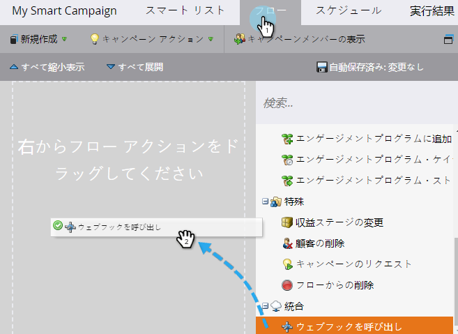
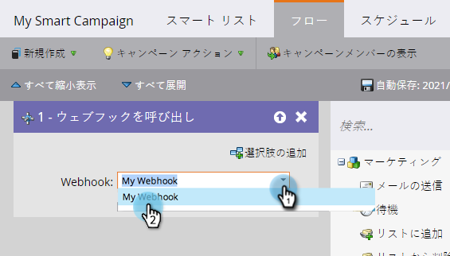
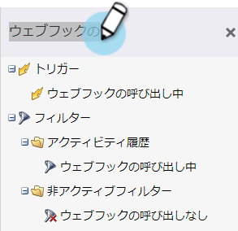
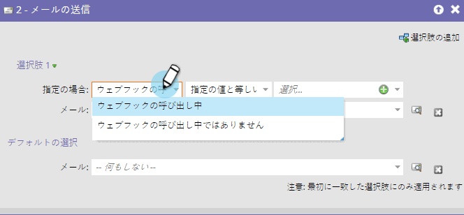

# スマートキャンペーンでのWebフックの使用{#use-a-webhook-in-a-smart-campaign}

[webhook](http://developers.marketo.com/documentation/webhooks/)を使用するには、[smartキャンペーン](/help/marketo/product-docs/core-marketo-concepts/smart-campaigns/flow-actions/add-a-flow-step-to-a-smart-campaign.md)にフローアクションとして追加します。

>[!AVAILABILITY]
>
>この機能を購入していないお客様もいます。 詳細については、セールス担当者にお問い合わせください。

1. [スマートキャンペーンの作成](/help/marketo/product-docs/core-marketo-concepts/smart-campaigns/creating-a-smart-campaign/create-a-new-smart-campaign.md)。

   >[!NOTE]
   >
   >Webhookは、トリガーキャンペーンでのみ使用できます。

1. 「**フロー**」タブに移動し、**Call Webhook**&#x200B;フローアクションをドラッグします。

   

1. Webフックを選択します。

   

1. Webhooksは、スマートリストでも使用できます。

   

1. 最後に、フローステップで&#x200B;**追加選択**&#x200B;のWebhooksを使用できます。

   
