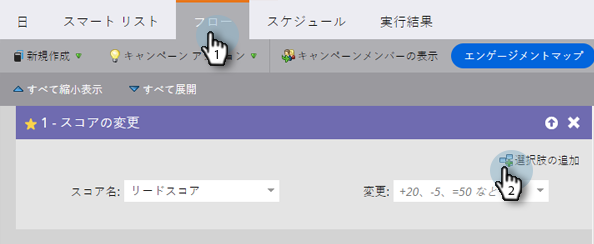
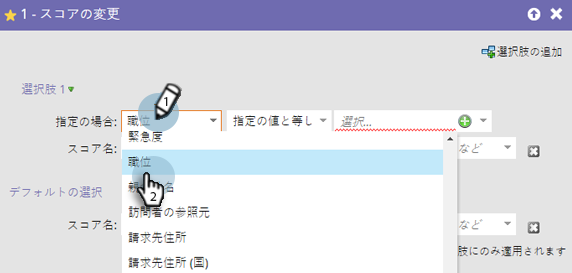
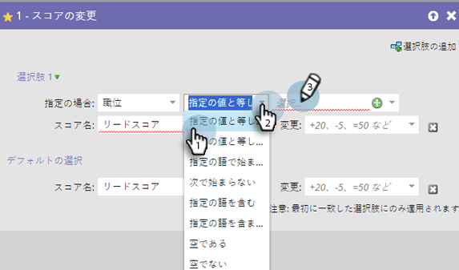
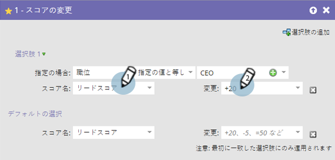
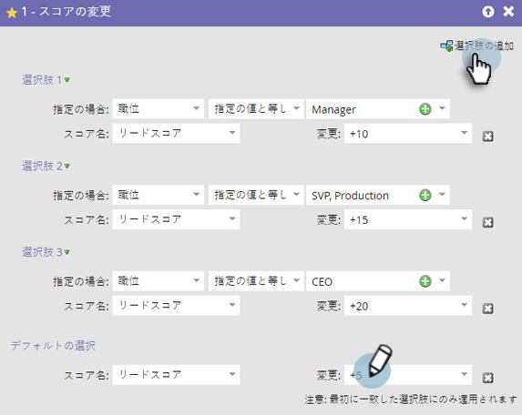

# フローステップでの「選択肢を追加」の使用 {#use-add-choice-in-a-flow-step}

>[!PREREQUISITES]
>
>[スマートキャンペーンへのフローステップの追加](/help/marketo/product-docs/core-marketo-concepts/smart-campaigns/flow-actions/add-a-flow-step-to-a-smart-campaign.md){target="_blank"}

「選択肢を追加」を使用すると、フローステップを使用でき、「条件に応じた」詳細の選択ができます。

1. スマートキャンペーンの「**[!UICONTROL フロー]**」タブで、任意のフローステップを追加し、「**[!UICONTROL 選択肢を追加]**」をクリックします。

   

1. 選択肢の条件を選択します。

   

1. 選択肢の演算子を選択して、値を入力します。これにより基準すなわち選択肢が設定されます。

   

1. 選択肢のフローステップ値を入力します。

   

   >[!CAUTION]
   >
   >選択肢のフローステップの条件部分では、トークンは正しく&#x200B;_機能しません_。

1. 上記の手順を繰り返して複数の選択肢を追加したら、デフォルト値を追加／調整します。

   

   >[!TIP]
   >
   >その選択肢に対して何も実行したくなければ、フローステップを「--何もしない--」に設定することも可能です。

   >[!CAUTION]
   >
   >フローステップに適用されるのは、最初に一致した選択肢だけです。詳しくは、[フローアクションの「選択肢を追加」の並べ替え](/help/marketo/product-docs/core-marketo-concepts/smart-campaigns/flow-actions/reorder-add-choice-in-a-flow-step.md){target="_blank"}を参照してください。

   完了です。選択肢ごとに複数のスマートキャンペーンを作成するのではなく、フローステップ選択肢を用いた単一のスマートキャンペーンを作成できました。

   >[!MORELIKETHIS]
   >
   >[フローステップの「選択肢を追加」の並べ替え](/help/marketo/product-docs/core-marketo-concepts/smart-campaigns/flow-actions/reorder-add-choice-in-a-flow-step.md){target="_blank"}
