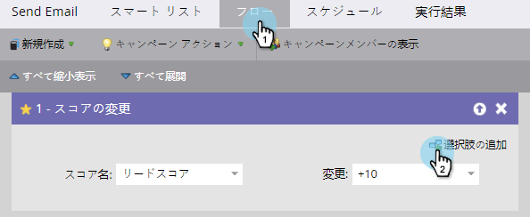
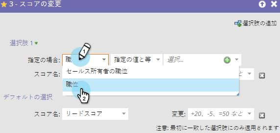
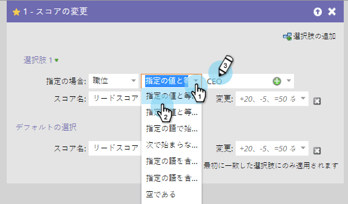
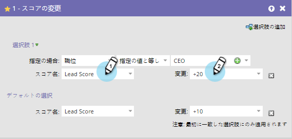
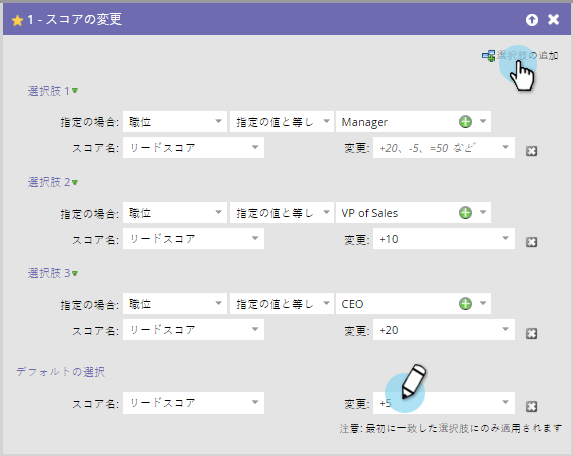

# フローステップでの追加選択の使用{#use-add-choice-in-a-flow-step}

>[!PREREQUISITES]
>
>[スマ追加ートキャンペーンへのフローステップ](/help/marketo/product-docs/core-marketo-concepts/smart-campaigns/flow-actions/add-a-flow-step-to-a-smart-campaign.md)

**フロ追加ー手順を使用して、詳細を選択する際に「次に依存する」と入力するように選択します。** 

1. スマートキャンペーンの「**フロー**」タブで、フロー手順を追加し、「**追加選択**」をクリックします。

   

1. 選択条件を選択します。

   

1. 選択演算子を選択し、選択値を入力します。 条件または選択肢が設定されます。

   

1. 選択肢のフローステップの値を入力します。

   

   >[!CAUTION]
   >
   >トークンは、選択フロー手順の条件部分では&#x200B;****&#x200B;機能しません。

1. 上記の手順を繰り返して複数の選択肢を追加し、デフォルト値を追加/調整します。

   

   >[!TIP]
   >
   >フローステップを —Do Nothing — に設定すると、その選択に対して何も実行されません。

   >[!CAUTION]
   >
   >最初に一致した選択肢のみがフローステップに適用されます。 フローアクション](/help/marketo/product-docs/core-marketo-concepts/smart-campaigns/flow-actions/reorder-add-choice-in-a-flow-step.md)の「追加選択」を[並べ替える方法を説明します。

   素晴らしい！ 各選択肢に対して複数のスマートキャンペーンを作成する代わりに、フローステップの選択肢を持つ1つのスマートキャンペーンを作成できるようになりました。

   >[!MORELIKETHIS]
   >
   >[フローステップの追加選択肢の並べ替え](/help/marketo/product-docs/core-marketo-concepts/smart-campaigns/flow-actions/reorder-add-choice-in-a-flow-step.md)
