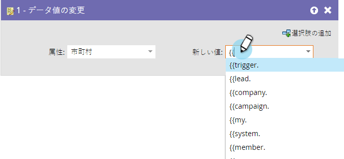
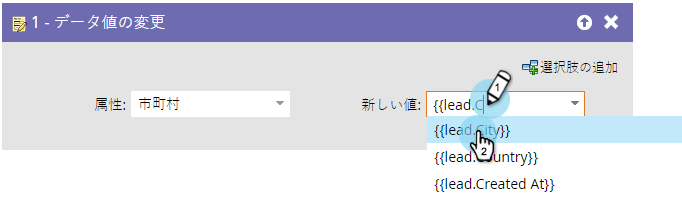

# フローステップでのトークンの使用 {#use-tokens-in-flow-steps}

>[!PREREQUISITES]
>
>[スマートキャンペーンへのフローステップの追加](/help/marketo/product-docs/core-marketo-concepts/smart-campaigns/flow-actions/add-a-flow-step-to-a-smart-campaign.md)

トークンは変数です。 Eメール、ランディングページ、スマートキャンペーンで使用すると、生活を容易にすることができます。 フローステップ、web フック、メール、ランディングページで[マイトークン](/help/marketo/product-docs/core-marketo-concepts/programs/tokens/understanding-my-tokens-in-a-program.md)（カスタムトークン）を使用できます。トークンを使用して、これらのフローステップに変数コンテンツを含めることができます。

* データ値の変更
* プログラムメンバーの変更
* 注目のアクション
* Salesforceキャンペーンの手順（ステータスの追加、削除、変更）
* タスクの作成
* アラートの送信(トリガーキャンペーンのみ)

1. フローステップで、`{{`と入力し、トークンのカテゴリを取得します。

   

   >[!NOTE]
   >
   >使用可能なトークンのリストについては、「[トークンの概要](/help/marketo/product-docs/demand-generation/landing-pages/personalizing-landing-pages/tokens-overview.md)」を参照してください。

1. 目的のトークンが見つかるまで入力を続け、「 」をクリックして選択します。

   

   >[!TIP]
   >
   >注目の瞬間、タスクの作成、アラートの送信の各フローステップで、複数のトークンを使用できます。

   >[!NOTE]
   >
   >プログラムメンバーのカスタムフィールドトークンは、次の場所で使用できます。タスクの作成、Microsoftでのタスクの作成、興味深い瞬間、データ値のフローアクションの変更、Webフック。

   これで完了です。スマートキャンペーンが実行されると、データはトークンから取り込まれます。

   >[!MORELIKETHIS]
   >
   >* [マイトークンの管理](/help/marketo/product-docs/core-marketo-concepts/programs/tokens/managing-my-tokens.md)
   >* [プログラム内のマイトークンの理解](/help/marketo/product-docs/core-marketo-concepts/programs/tokens/understanding-my-tokens-in-a-program.md)

