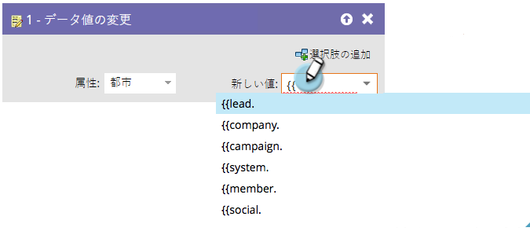
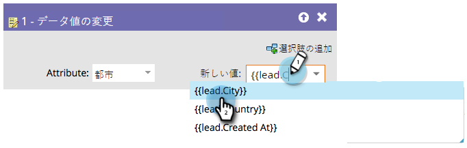

# フローステップでのトークンの使用 {#use-tokens-in-flow-steps}

>[!PREREQUISITES]
>
>[スマートキャンペーンへのフローステップの追加](/help/marketo/product-docs/core-marketo-concepts/smart-campaigns/flow-actions/add-a-flow-step-to-a-smart-campaign.md){target="_blank"}

トークンは変数です。メール、ランディングページ、スマートキャンペーンで使用することで、作業が手軽になります。フローステップ、web フック、メール、ランディングページで[マイトークン](/help/marketo/product-docs/core-marketo-concepts/programs/tokens/understanding-my-tokens-in-a-program.md){target="_blank"}（カスタムトークン）を使用できます。トークンを使用して、次のフローステップに変数コンテンツを含めることができます。

* データ値の変更
* プログラムメンバーの変更
* 注目のアクション
* [!DNL Salesforce] キャンペーン手順（追加、削除、ステータスの変更）
* タスクの作成
* アラートの送信（トリガーキャンペーンのみ）

1. フローステップで、`{{` と入力し始めると、トークンのカテゴリが表示されます。

   

   >[!NOTE]
   >
   >使用可能なトークンについて、[トークンの概要](/help/marketo/product-docs/demand-generation/landing-pages/personalizing-landing-pages/tokens-overview.md){target="_blank"}でいくつかリストアップしています。

1. 目的のトークンが見つかるまで入力し続け、クリックして選択します。

   

   >[!TIP]
   >
   >注目のアクション、タスクの作成、アラートの送信の各フローステップでは、複数のトークンを使用できます。

   >[!NOTE]
   >
   >プログラムメンバーカスタムフィールドトークンは、次の場所で使用できます。タスクの作成、Microsoft でのタスクの作成、注目のアクション、データ値の変更フローアクション、web フック。

   これで完了です。スマートキャンペーンが実行されると、データがトークンから取り出されます。

   >[!MORELIKETHIS]
   >
   >* [マイトークンの管理](/help/marketo/product-docs/core-marketo-concepts/programs/tokens/managing-my-tokens.md){target="_blank"}
   >* [プログラム内のマイトークンの理解](/help/marketo/product-docs/core-marketo-concepts/programs/tokens/understanding-my-tokens-in-a-program.md){target="_blank"}
