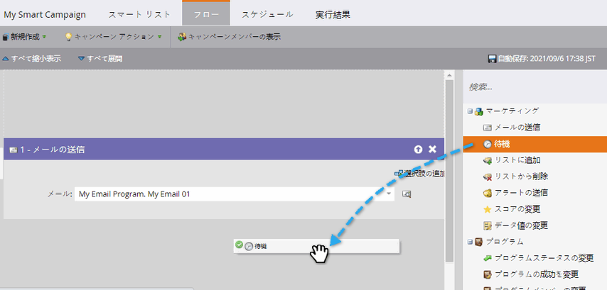
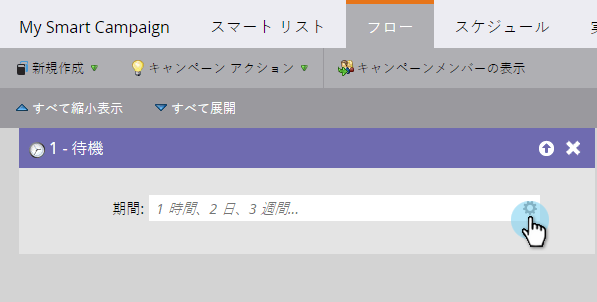
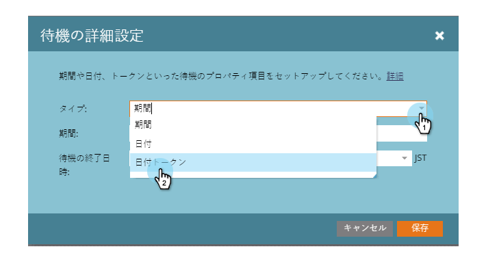
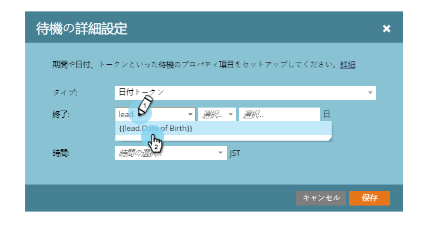
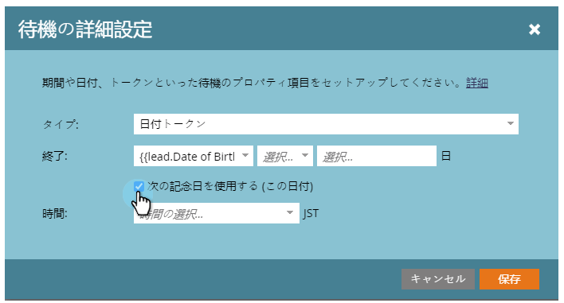
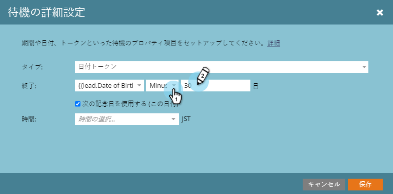
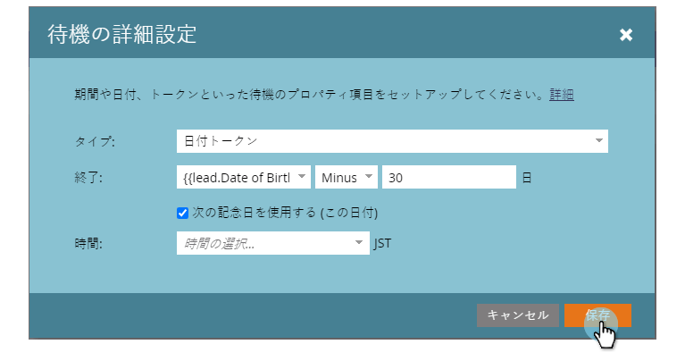

# 待機フロー手順での日付トークンの使用{#use-a-date-token-in-a-wait-flow-step}

待機フローステップを使用すると、スマートキャンペーンを介して、日付トークンを使用する特定の日付まで人のジャーニーを一時停止できます。 終了日は、日数によって変更することもできます。

>[!NOTE]
>
>これは、トリガーキャンペーンにのみ適用されます。 この機能はバッチキャンペーンでは使用できません。

1. スマートキャンペーン&#x200B;**「フロー**」タブで、**待機**&#x200B;フローステップの上にドラッグします。

   

1. 右側の歯車アイコンをクリックします。

   

1. 「**タイプ**」ドロップダウンから、「**日付トークン**」を選択します。

   

1. 日付トークンを選択して、待機ステップを終了するタイミングを指定します。

   * `{{my._____}}`
   * `{{lead.______}}`
   * `{{company.______}}`
   * `{{system._______}}`

   

1. 現在または次の年に発生する日付の次の記念日まで待つには、チェックボックスをオンにします。

   

   >[!TIP]
   >
   >このオプションは、誕生日や契約開始日など、過去の日付を参照する日付トークンに対して使用します。

1. オプションで、終了日を指定した日数だけ変更できます。

   

   >[!NOTE]
   >
   >整数フィールドを表す`{{lead.`または`{{company.`トークン、または数値型の`{{my.`トークンを使用して、日数を指定することもできます。

1. 「**保存**」をクリックします。

   

   >[!MORELIKETHIS]
   >
   >* [待機フローステップでの期間の使用](/help/marketo/product-docs/core-marketo-concepts/smart-campaigns/flow-actions/wait/use-a-duration-in-a-wait-flow-step.md)
   >* [特定の日付を待機フロー・ステップで使用](/help/marketo/product-docs/core-marketo-concepts/smart-campaigns/flow-actions/wait/use-a-specific-date-in-a-wait-flow-step.md)

