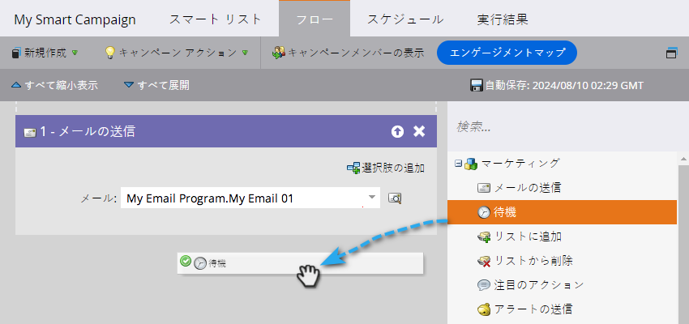
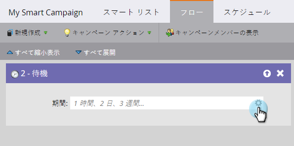
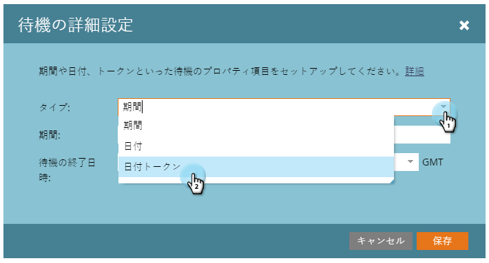
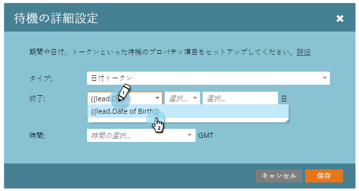
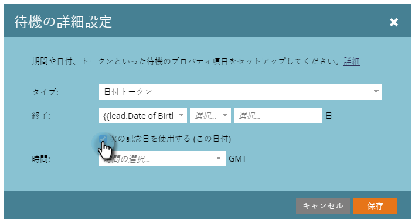
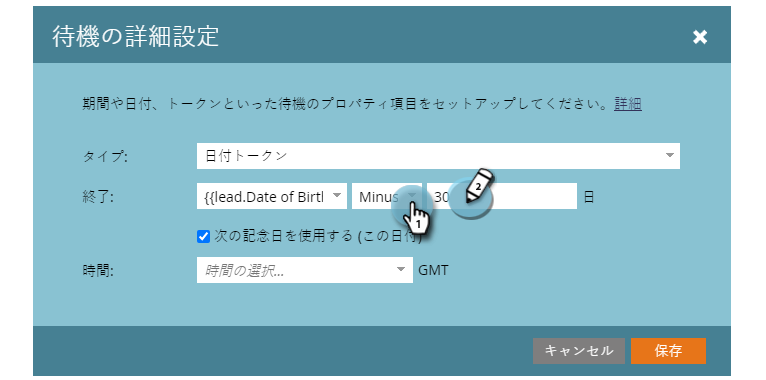
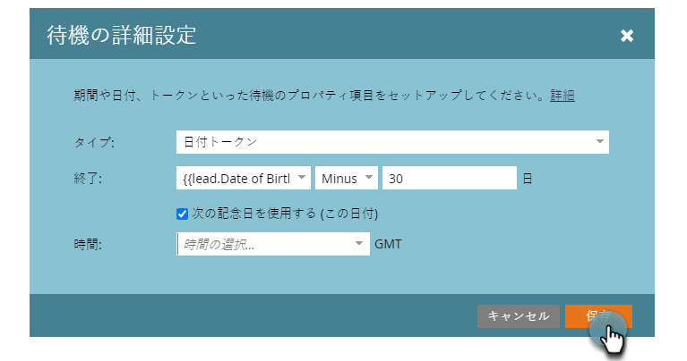

# 待機フローステップで日付トークンを使用 {#use-a-date-token-in-a-wait-flow-step}

待機フローステップを使用すると、スマートキャンペーンを通じて、日付トークンを使用する特定の日付まで個人のジャーニーを一時停止できます。 また、終了日を日数で変更することもできます。

>[!NOTE]
>
>これは、トリガーキャンペーンにのみ当てはまります。 この機能はバッチキャンペーンでは使用できません。

1. スマートキャンペーンの「**[!UICONTROL フロー]**」タブで、**[!UICONTROL 待機]**&#x200B;フローステップをドラッグします。

   

1. 歯車アイコンをクリックします。

   

1. **[!UICONTROL タイプ]**&#x200B;ドロップダウンで、「**[!UICONTROL 日付トークン]**」を選択します。

   

1. 「[!UICONTROL 日付トークン]」を選択して、待機ステップを終了するタイミングを指定します。

   * `{{my._____}}`
   * `{{lead.______}}`
   * `{{company.______}}`
   * `{{system._______}}`

   

1. 今年または翌年に発生する次のイベント日まで待つには、チェックボックスをオンにします。

   

   >[!TIP]
   >
   >このオプションは、誕生日や契約の開始日など、過去の日付を参照する日付トークンに対して使用します。

1. 必要に応じて、終了日を指定した日数で変更できます。

   

   >[!NOTE]
   >
   >また、整数フィールドを表す `{{lead.` または `{{company.` トークンを使用するか、`{{my.` 番号タイプのトークンを使用して、日数を指定することもできます。

1. 「**[!UICONTROL 保存]**」をクリックします。

   

   >[!MORELIKETHIS]
   >
   >* [待機フローステップで停止期間を使用](/help/marketo/product-docs/core-marketo-concepts/smart-campaigns/flow-actions/wait/use-a-duration-in-a-wait-flow-step.md){target="_blank"}
   >* [待機フローステップで特定の日付を使用](/help/marketo/product-docs/core-marketo-concepts/smart-campaigns/flow-actions/wait/use-a-specific-date-in-a-wait-flow-step.md){target="_blank"}
