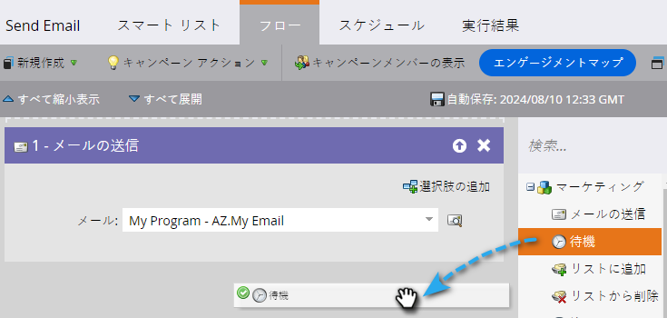
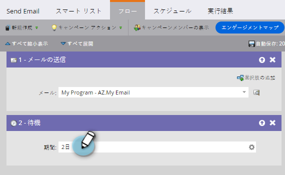
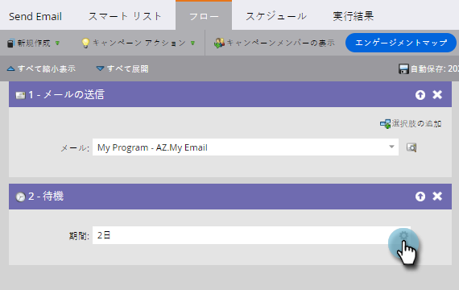
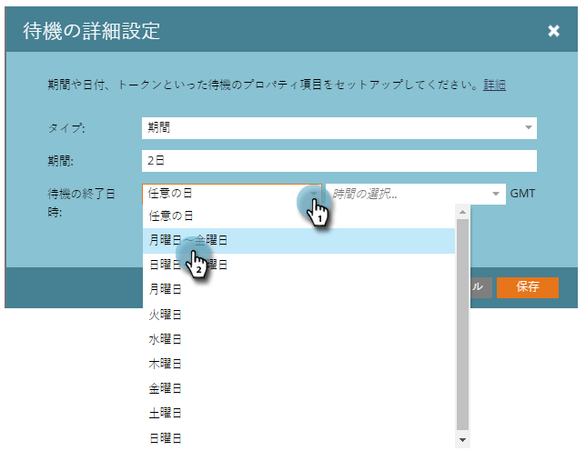
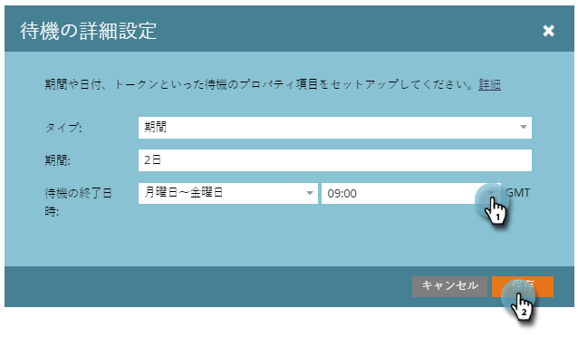

# 待機フローステップで停止期間を使用 {#use-a-duration-in-a-wait-flow-step}

待機フローステップを使用すると、スマートキャンペーンを通じて一定期間、個人のジャーニーを一時停止できます。また、曜日と終了時刻の条件も指定できます。

1. スマートキャンペーンの「**[!UICONTROL フロー]**」タブで、**[!UICONTROL 待機]**&#x200B;フローステップをドラッグします。

   

1. 一時停止する期間を入力します。

   

1. これで完了です。フローは、指定された期間一時停止します。詳細設定オプションについては、右側の歯車アイコンをクリックします。

   

1. 待機ステップを終了する曜日を指定します。

   

1. 必要に応じて、時刻を指定します。「**[!UICONTROL 保存]**」をクリックします。

   

   >[!NOTE]
   >
   >**例**
   >
   >ある人が金曜日の午後 5 時にスマートキャンペーンをトリガーします。待機ステップは、48 時間、月～金曜日の午前 9 時に終了、といったように詳細に設定します。
   >
   >その結果、その人は&#x200B;**月曜日午前 9 時**&#x200B;にフローを続行することになります。これは、48 時間後、月～金曜日の中で最初に該当するものです。

   >[!NOTE]
   >
   >期間、日付、時間、使用日数はすべて、ご利用のサブスクリプションのタイムゾーンに基づきます。

   >[!MORELIKETHIS]
   >
   >* [待機フローステップで特定の日付を使用](/help/marketo/product-docs/core-marketo-concepts/smart-campaigns/flow-actions/wait/use-a-specific-date-in-a-wait-flow-step.md){target="_blank"}
   >* [待機フローステップで日付トークンを使用](/help/marketo/product-docs/core-marketo-concepts/smart-campaigns/flow-actions/wait/use-a-date-token-in-a-wait-flow-step.md){target="_blank"}
