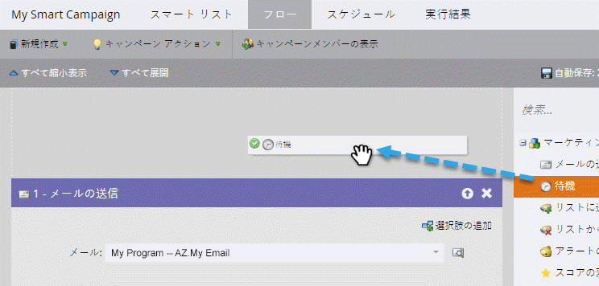
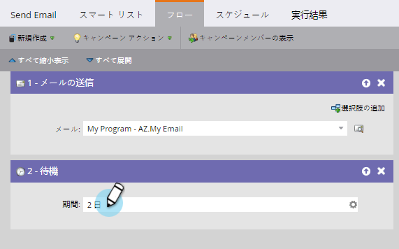
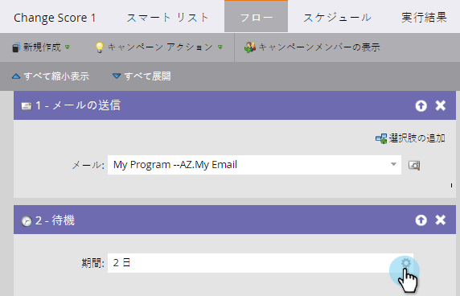
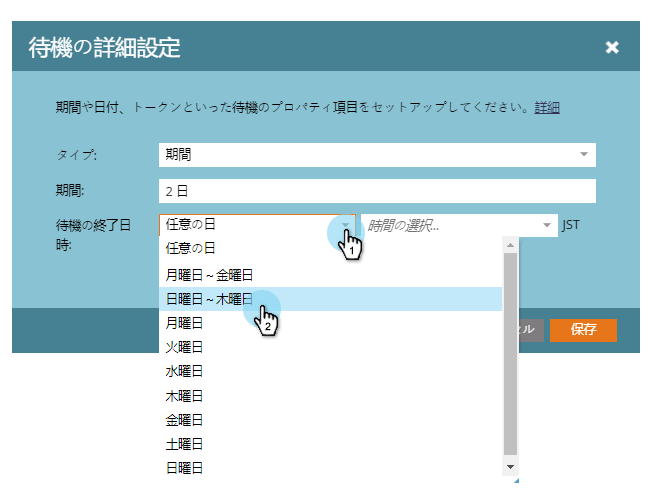
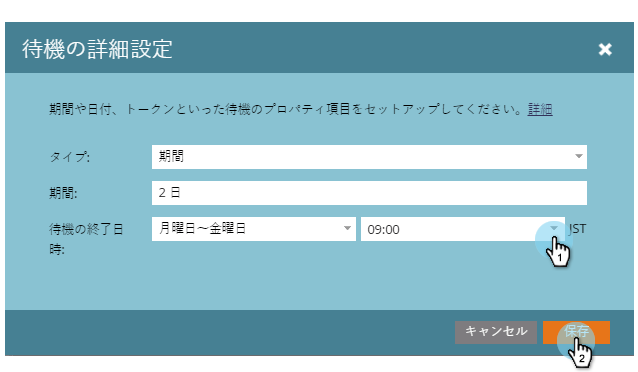

# 待機フローステップでの期間の使用 {#use-a-duration-in-a-wait-flow-step}

待機フローステップを使用すると、スマートキャンペーンを通るユーザーの遍歴を一定の期間一時停止できます。 また、曜日と終了時刻の条件を指定することもできます。

1. スマートキャンペーンの「 **フロー** 」タブで、 **** 待機フローステップの上にドラッグします。

   

1. 一時停止する時間を入力します。

   

1. それだ！ 指定した期間、フローが一時停止します。 詳細オプションについては、右側の歯車アイコンをクリックします。

   

1. 待機ステップを終了する曜日を指定します。

   

1. 必要に応じて、時間を指定します。 「 **保存**」をクリックします。

   

   >[!NOTE]
   >
   >**例**
   >
   >
   >ある人が金曜日の午後5時にスマートキャンペーンを引き受けます。 待機ステップが詳細に設定されています。48時間で月～金の午前9時に終了する必要があります。
   >
   >
   >その結果、その人は **月曜日の午前9時にフローを続ける**。 これは、48時間後の最初の月曜日です。

   >[!NOTE]
   >
   >使用する期間、日付、時間および日数は、すべて購読のタイムゾーンに基づきます。

   >[!NOTE]
   >
   >**関連記事**
   >
   >    
   >    
   >    * [特定の日付を待機フロー・ステップで使用](use-a-specific-date-in-a-wait-flow-step.md)
   >    * [待機フロー手順での日付トークンの使用](use-a-date-token-in-a-wait-flow-step.md)

