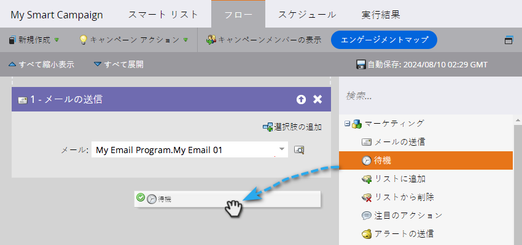
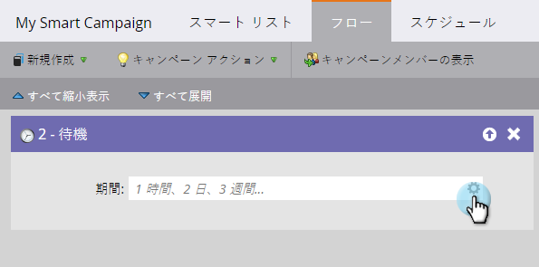
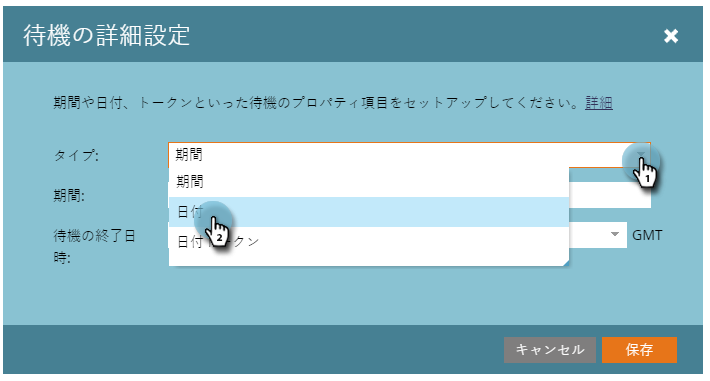
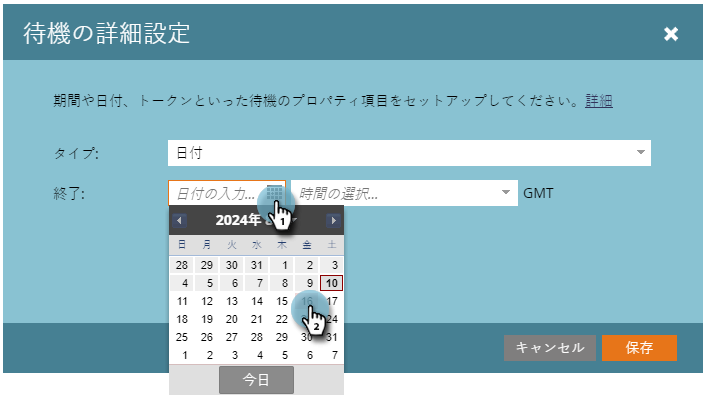
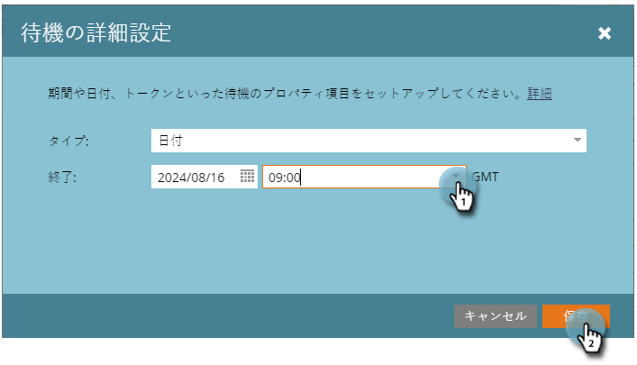

# 待機フローステップで特定の日付を使用 {#use-a-specific-date-in-a-wait-flow-step}

「[!UICONTROL 待機]」フローステップを使用すると、スマートキャンペーンを通じて特定の日付まで個人のジャーニーを一時停止できます。

1. スマートキャンペーンの「**[!UICONTROL フロー]**」タブで、**[!UICONTROL 待機]**&#x200B;フローステップをドラッグします。

   

1. 歯車アイコンをクリックします。

   

1. 「**[!UICONTROL タイプ]**」ドロップダウンで、「**[!UICONTROL 日付]**」を選択します。

   

1. 再開する特定の日付を選択します。

   

1. 時間（オプション）を指定し、「**[!UICONTROL 保存]**」をクリックします。

   

>[!MORELIKETHIS]
>
>* [待機フローステップで停止期間を使用](/help/marketo/product-docs/core-marketo-concepts/smart-campaigns/flow-actions/wait/use-a-duration-in-a-wait-flow-step.md){target="_blank"}
>* [待機フローステップで日付トークンを使用](/help/marketo/product-docs/core-marketo-concepts/smart-campaigns/flow-actions/wait/use-a-date-token-in-a-wait-flow-step.md){target="_blank"}
