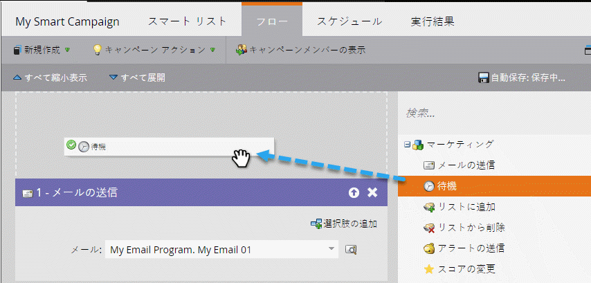
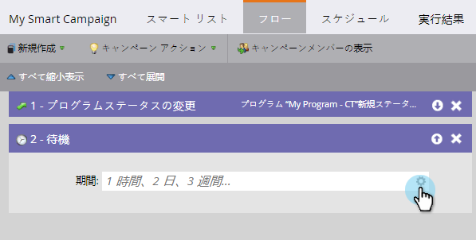
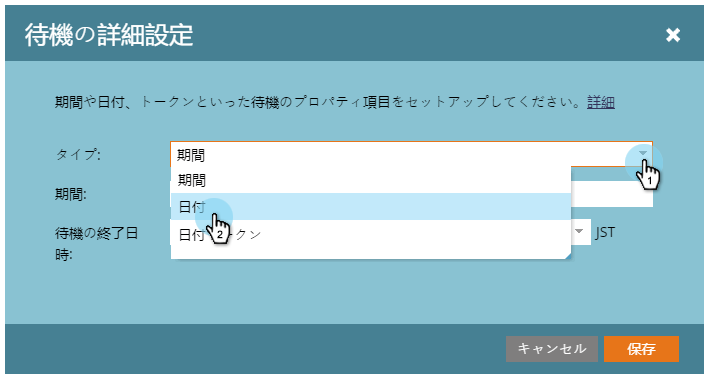
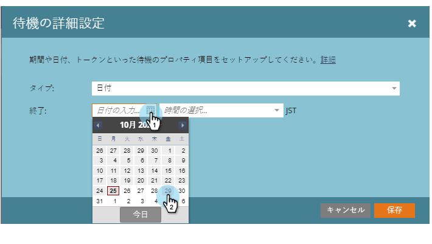
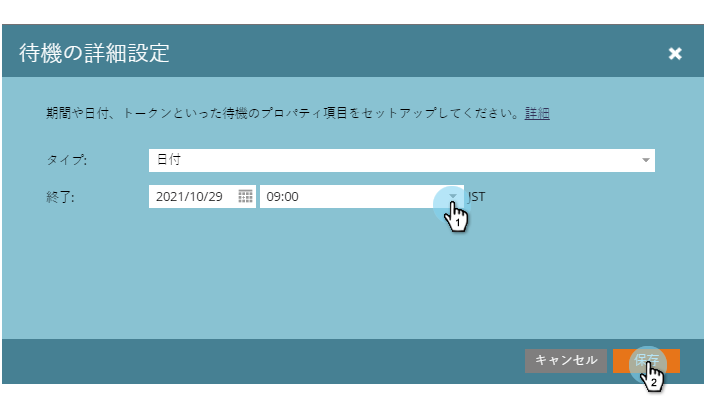

# 特定の日付を待機フロー・ステップで使用 {#use-a-specific-date-in-a-wait-flow-step}

「 **待機** 」フローステップを使用すると、スマートキャンペーンを介して特定の日付までのユーザーの遍歴を一時停止できます。

1. スマートキャンペーンの「 **フロー** 」タブで、 **** 待機フローステップの上にドラッグします。

   

   右側の歯車アイコンをクリックします。

   

   「タイプ」ドロップダウンで、「日付」を選択します。

   

   再開する特定の日付を選択します。

   

   時間を指定し（オプション）、「保存」をクリックします。
   

>[!NOTE]
>
>**関連記事**
>
>* [待機フローステップでの期間の使用](use-a-duration-in-a-wait-flow-step.md)
>* [待機フロー手順での日付トークンの使用](use-a-date-token-in-a-wait-flow-step.md)

>

