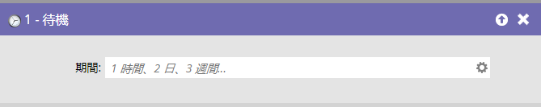

# Wait {#wait}

>[!NOTE]
>
>**FYI**
>
>Marketoは現在、すべての購読で言語を標準化しているので、購読およびdocs.marketo.comの人物/人物にリード/リードを表示できます。 これらの用語は同じことを意味し、記事の説明には影響しません。 他にも変化がある。 [詳細情報](/help/marketo/getting-started/updates-to-marketo-terminology.md)。

## 概要 {#overview}

便利な **待機ステップを使用して、スマートキャンペーンフローで人を一時停止します**。

「4時間」のような自然言語での入力方法に注目してください。 ただし、単語 ****&#x200B;の省略形（例：4時間）は使用しないでください。 スマートキャンペーンは引き続き実行されますが、待機ステップは無視されます。

>[!CAUTION]
>
>待機ステップの期間を変更しても、既に入力されているユーザーには影響しません。 次に例を示します。5日間の待機ステップがある場合、ユーザーが入力した後、待機ステップを7日に変更します。そのユーザーは、元の5日間だけ待機してから次のフローステップに進みます。

>[!TIP]
>
>既に待機ステップに入っているユーザーが、待機期間が終了した後に先に進めないようにする場合は、待機ステップの直後にフローから [削除を挿入し](/help/marketo/product-docs/core-marketo-concepts/smart-campaigns/flow-actions/remove-from-flow.md) ます。 「選択肢を [追加](/help/marketo/product-docs/core-marketo-concepts/smart-campaigns/flow-actions/use-add-choice-in-a-flow-step.md) 」オプションを使用して、削除するユーザーを指定します。

## 使用状況 {#usage}

待機フロー手順は、主に次の3つの方法で使用できます。

1. [待機フローステップでの期間の使用](/help/marketo/product-docs/core-marketo-concepts/smart-campaigns/flow-actions/wait/use-a-duration-in-a-wait-flow-step.md)
1. [特定の日付を待機フロー・ステップで使用](/help/marketo/product-docs/core-marketo-concepts/smart-campaigns/flow-actions/wait/use-a-specific-date-in-a-wait-flow-step.md)
1. [待機フロー手順での日付トークンの使用](/help/marketo/product-docs/core-marketo-concepts/smart-campaigns/flow-actions/wait/use-a-date-token-in-a-wait-flow-step.md)
