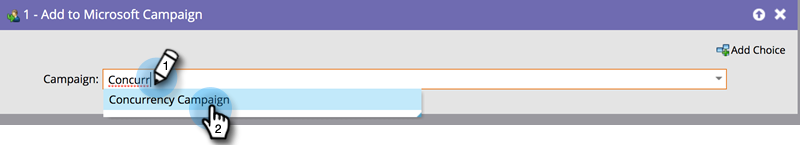
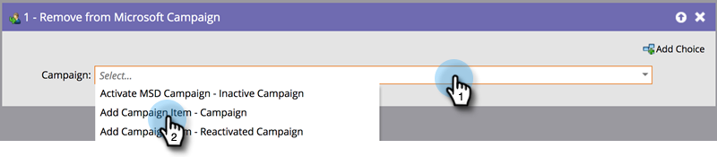

# [!DNL Dynamics] Campaign での人物の追加または削除 {#add-or-remove-people-from-your-dynamics-campaign}

## Dynamics キャンペーンへの追加 {#add-to-dynamics-campaign}

このフローステップは、Marketo Engage スマートキャンペーンで人物を Microsoft キャンペーンのリードまたは取引先責任者として追加するのに使用できます。 Dynamics にまだ存在しない場合、リードは自動的に同期され、キャンペーンに追加されます。

>[!NOTE]
>
>このフローアクションは、トリガーキャンペーンでのみ使用できます。

スマートキャンペーンで、人物を追加する Dynamics キャンペーンを見つけて選択します。

>[!NOTE]
>
>キャンペーンリストにDynamics キャンペーンが表示されない場合：
>
>* Campaign Syncが機能することを確認します
>* キャンペーンが [!DNL Microsoft Dynamics] でアクティブではありません

リード用と取引先責任者用に、それぞれ人物を追加するためのキャンペーン固有の静的マーケティングリストが自動的に作成されます。 これは 1 回限りのアクションで、以降のキャンペーンの同期では、同じマーケティングリストが使用されます。 静的なマーケティングリスト名に採用されている命名規格は、リードの場合は `Mkto-leads-<uniqueID>`、連絡先の場合は `Mkto-contacts-<uniqueID>` です。

これらの Marketo で生成されたマーケティングリストを他のキャンペーンに関連付けると、混乱を招く可能性があります。 例：1 つ目のキャンペーンに追加すると、2 つ目のキャンペーンにも追加されます。 同様に、Marketo で生成されたマーケティングリストの関連付けを [!DNL Dynamics] のキャンペーンから解除することもお勧めしません。

## Dynamics キャンペーンからの削除 {#remove-from-dynamics-campaign}

このフローステップは、Marketo スマートキャンペーンで Microsoft キャンペーンから人物を削除するために使用できます。 「Microsoft キャンペーンに追加」フローアクションによってキャンペーンに以前に追加されたリードのみが削除されます。

>[!NOTE]
>
>このフローアクションは、トリガーキャンペーンでのみ使用できます。

スマートキャンペーンで、メンバーを削除する対象の Dynamics キャンペーンを見つけて選択します。

>[!NOTE]
>
>キャンペーンリストに[!DNL Dynamics] キャンペーンが表示されない場合：
>
>* Campaign Syncが機能することを確認します
>* キャンペーンが [!DNL Microsoft Dynamics] でアクティブではありません
