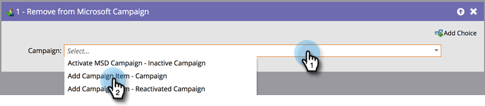

# Dynamicsキャンペーン追加からユーザーを削除する{#add-or-remove-people-from-your-dynamics-campaign}

## Dynamics追加キャンペーン{#add-to-dynamics-campaign}

このフローステップは、Marketo Smartキャンペーンで使用して、Microsoftキャンペーンのリードまたは連絡先として人を追加できます。 リードがDynamicsにまだ存在しない場合は、自動的に同期され、キャンペーンに追加されます。

>[!NOTE]
>
>このフローアクションは、トリガーキャンペーンに対してのみ使用できます。

スマートキャンペーンで、ユーザーを追加するDynamicsキャンペーンを探して選択します。

>[!NOTE]
>
>キャンペーンリストにDynamicsキャンペーンが表示されない場合：
>
>* キャンペーン同期が機能していることを確認する
>* キャンペーンはMicrosoft Dynamicsでアクティブではありません

キャンペーンに固有の静的マーケティングリストが自動的に作成され、各顧客はリードと連絡先に対して、その顧客を追加します。 これは1回限りのアクションで、キャンペーンへの後続の同期に1回限り、同じマーケティングリストが使用されます。 静的マーケティングリスト名に採用されている命名規則は、リードの場合は`Mkto-leads-<uniqueID>`、連絡先の場合は`Mkto-contacts-<uniqueID>`です。

これらのマーケティングリストを他のキャンペーンに関連付けると、分かりにくい行動を引き起こす可能性があります。 次に例を示します。1つのキャンペーンに追加すると、2つ目のキャンペーンにも追加されます。 同様に、Marketo生成マーケティングリストとDynamicsのキャンペーンの関連付けを解除することもお勧めしません。

## Dynamicsキャンペーンから削除{#remove-from-dynamics-campaign}

このフローステップは、Marketo SmartキャンペーンでMicrosoftキャンペーンからユーザーを削除する場合に使用できます。 これにより、「Microsoftキャンペーンに追加」のフロー操作を通してキャンペーンに以前に追加されたキャンペーンのリードのみが削除されます。

>[!NOTE]
>
>このフローアクションは、トリガーキャンペーンに対してのみ使用できます。

スマートキャンペーンで、ユーザーを削除するDynamicsキャンペーンを探して選択します。

>[!NOTE]
>
>キャンペーンリストにDynamicsキャンペーンが表示されない場合：
>
>* キャンペーン同期が機能していることを確認する
>* キャンペーンはMicrosoft Dynamicsでアクティブではありません

