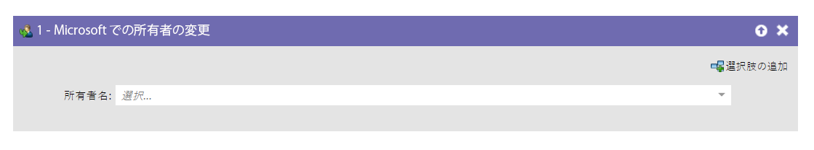
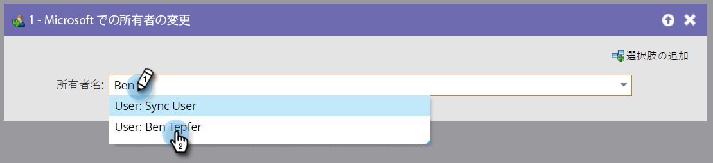

# Microsoft の所有者の変更 {#change-owner-in-microsoft}

このフローステップを使用して、既に所有者に割り当てられている人物を別の所有者に再割り当てできます。

>[!NOTE]
>
>このフローステップは、スマートキャンペーンで、フィルターではなく、_トリガーで使用された場合にのみ機能_&#x200B;します。

**使用方法**

1. 変更したい所有者を選択するだけです。

   

   >[!NOTE]
   >
   >レコードが Dynamics アカウントにまだ存在しない場合は、同期されて選択したユーザーに割り当てられす。
