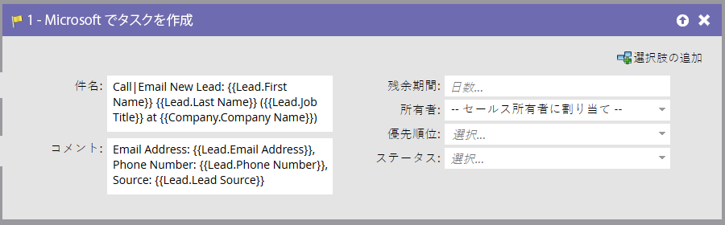
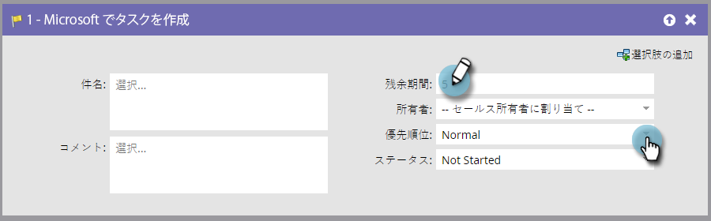

# Microsoft でのタスクの作成 {#create-task-in-microsoft}

マーケターは、取引の成立に関して営業を支援できる情報を持っています。タスクを作成して、タスクの実行内容と実行タイミングを営業に知らせることができます。

「Microsoft でタスクを作成」は、[!DNL Microsoft] で人物（リードまたは取引先責任者）に関連するアクティビティの下にタスクを作成します。

>[!NOTE]
>
>このフローステップは、スマートキャンペーンで、フィルターではなく、_トリガーで使用された場合にのみ機能_&#x200B;します。

デフォルトでは、フローステップは次のようになります。

>[!NOTE]
>
>Marketo 同期ユーザがタスクを作成する場合、[!DNL Microsoft] でタスクを作成するには「**[!UICONTROL 期限]**」が必須フィールドです。この値を入力しない場合、Marketo でデフォルトの 5 日が自動入力されます。

すべてのフィールドをカスタマイズして、目的のタスクを作成します。

>[!NOTE]
>
>「フローアクション」でタスクに対して指定された「ステータス」フィールドにより、[!DNL Microsoft] の「ステータス理由」フィールドが更新されます。

>[!TIP]
>
>**[!UICONTROL 件名]**&#x200B;と&#x200B;**[!UICONTROL 説明]**&#x200B;で、`{{lead.tokens}}`、`{{company.tokens}}`、`{{campaign.tokens}}`、`{{system.tokens}}` を使用できます。詳しくは、[フローステップのトークン](/help/marketo/product-docs/core-marketo-concepts/smart-campaigns/flow-actions/use-tokens-in-flow-steps.md){target="_blank"}を参照してください。
