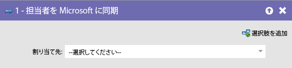
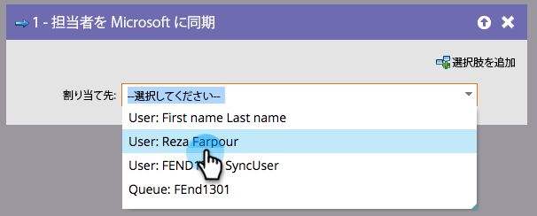

# リードをマイクロソフトに同期 {#sync-person-to-microsoft}

この機能は、Marketo Engageを [!DNL Microsoft Dynamics] と統合するユーザー専用です。

## 概要 {#overview}

このフローステップは、Marketo が作成したリードを Dynamics CRM に挿入するものです。

## 使用方法 {#usage}

Dynamics ユーザーをリード所有者として設定できます。

>[!NOTE]
>
>「[!UICONTROL  ユーザーをMicrosoftに同期 ]」フローアクション（トリガーキャンペーンのみ）を使用する場合、リード/連絡先は Dynamics でリアルタイムに作成されます。
