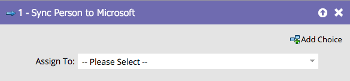

# ユーザーをMicrosoftに同期{#sync-person-to-microsoft}

この機能は、MarketoをMicrosoft Dynamicsと統合しているユーザーのみが対象です。

## 概要{#overview}

このフロー手順により、Marketorが作成した人がDynamics CRMに挿入されます。

## 使用法{#usage}

Dynamicsユーザーを個人所有者として設定できます。

>[!NOTE]
>
>「個人をMicrosoftに同期」フローアクション(トリガーキャンペーンのみ)を使用する場合、リード/連絡先はDynamicsでリアルタイムに作成されます。
