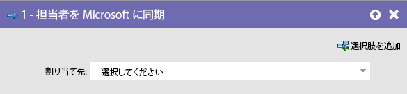
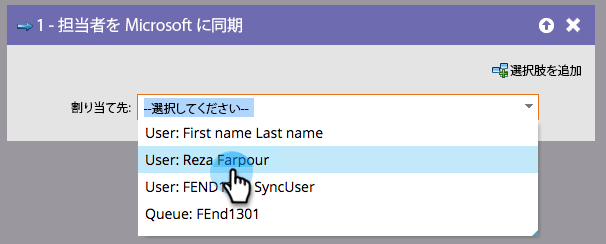

# 人物をマイクロソフトに同期 {#sync-person-to-microsoft}

この機能は、Marketo Engage と [!DNL Microsoft Dynamics] を連携しているお客様専用です。

## 概要 {#overview}

このフローステップは、Marketo が作成した人物を [!DNL Dynamics] CRM に挿入するものです。

## 使用方法 {#usage}

[!DNL Dynamics] ユーザを人物の所有者として設定できます。

>[!NOTE]
>
>「[!UICONTROL 人物を Microsoft に同期]」フローアクション（トリガーキャンペーン内のみ）を使用すると、Dynamics でリード／取引先責任者がリアルタイムで作成されます。
