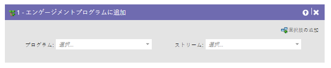
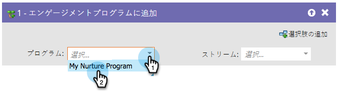
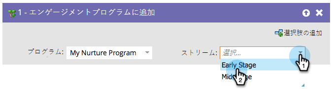

# エンゲージメントプログラムへの追加 {#add-to-engagement-program}

このフローステップで作成したスマートキャンペーンは、エンゲージメントプログラムへの入り口となります。

1. まず、リードを追加したいエンゲージメントプログラムを選択します。

   

1. 次に、リードを配置したいストリームを選択します。

   

   >[!NOTE]
   >
   >同一のプログラム内で、1 つのリードを複数のストリームに追加することはできません。
