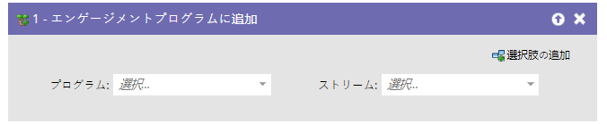
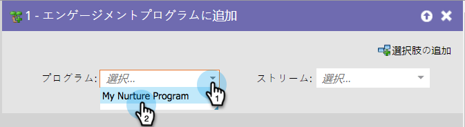
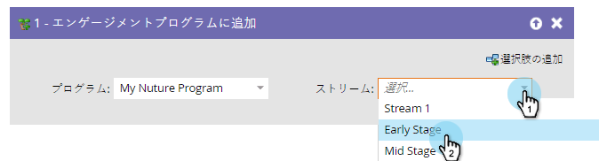

# エンゲージメ追加ントプログラム{#add-to-engagement-program}

## 概要{#overview}

このフロー手順で作成するスマートキャンペーンは、エンゲージメントプログラムのゲートウェイとなります。

## 使用法{#usage}

1. ユーザーを追加するエンゲージメントプログラムを選択します。

   

1. ユーザーを配置するストリームを選択します。

   

   >[!NOTE]
   >
   >1人のユーザーを同じプログラム内の複数のストリームに追加することはできません。
