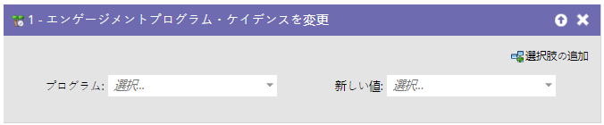
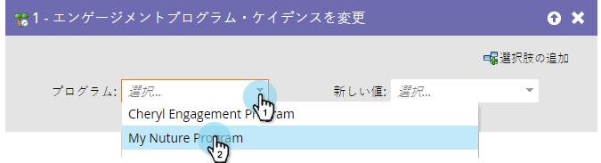
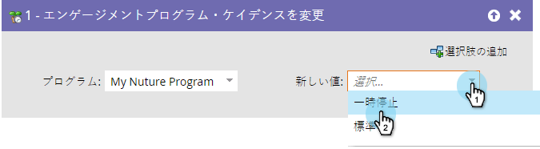

# アクションプログラムカデンスの変更 {#change-engagement-program-cadence}

>[!NOTE]
>
>**FYI**
>
>Marketoは現在、すべての購読で言語を標準化しているので、購読およびdocs.marketo.comの人物/人物にリード/リードを表示できます。 これらの用語は同じことを意味し、記事の説明には影響しません。 他にも変化がある。 [詳細情報](http://docs.marketo.com/display/DOCS/Updates+to+Marketo+Terminology)。

1. 概要

   エンゲージメントプログラムによって人が育てられると、このフロー手順を使用して、その人の育成を一時的に一時停止できます。

   

   >[!NOTE]
   >
   >ユーザーがプログラムのメンバーでなく、このフロー手順を実行する場合は、メンバーとして自動的に最初のストリームに追加されます。

## 使用状況 {#usage}

1. アクションプログラムを選択します。

   

1. 「 **新しい値** 」で「 **** 一時停止」を選択して、ユーザーがコンテンツを受け取らないようにします。

   

   再びコンテンツの受信を開始したい場合は、ユーザーを **標準** (Normal)に戻すことができます。

