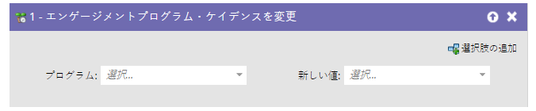
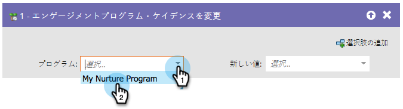
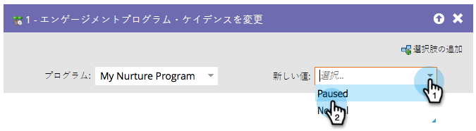

# エンゲージメントプログラムケイデンスの変更 {#change-engagement-program-cadence}

エンゲージメントプログラムでリードのナーチャリングが開始したら、このフローステップを使ってナーチャリングを一時的に停止できます。

>[!NOTE]
>
>リードがプログラムやフローアクションのメンバーではない場合、そのリードは、このフローステップ終了後、メンバーとして最初のストリームに自動的に追加されます。

1. エンゲージメントプログラムを選択します。

   

1. リードがコンテンツを受信しないように、「**[!UICONTROL 新しい値]**」で「**[!UICONTROL 一時停止]**」を選択します。

   

リードへのコンテンツ配信を再開する場合は、「**[!UICONTROL 標準]**」に戻します。
