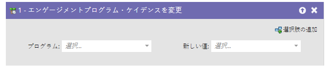
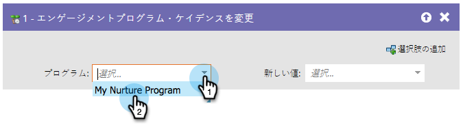
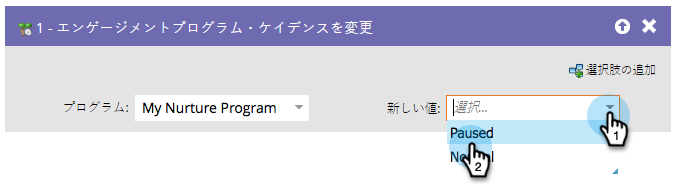

# エンゲージメントプログラムケイデンスの変更 {#change-engagement-program-cadence}

エンゲージメントプログラムで対象者のナーチャリングが開始されたら、このフローステップを使用して、その対象者のナーチャリングを一時的に停止できます。

>[!NOTE]
>
>対象者がプログラムのメンバーではない状態でこのフローステップを実行すると、その対象者は自動的にプログラムのメンバーとして追加され、最初のストリームに入れられます。

1. エンゲージメントプログラムを選択します。

   

1. リードがコンテンツを受信しないように、「**[!UICONTROL 新しい値]**」で「**[!UICONTROL 一時停止]**」を選択します。

   

   リードへのコンテンツ配信を再開する場合は、「**[!UICONTROL 標準]**」に戻します。
