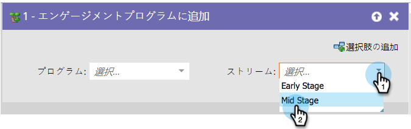

# エンゲージメントプログラムストリームの変更 {#change-engagement-program-stream}

## 概要 {#overview}

通常は、 [ストリームトランジションルールを使用してこれを達成しますが](../../../../product-docs/email-marketing/drip-nurturing/engagement-program-streams/transition-people-between-engagement-streams.md) 、あるストリームから別のストリームに人を手動で移動する場合は、これが使用するフローステップです。

## 使用状況 {#usage}

1. 個人の移動先のアクションプログラムを選択します。

   >[!NOTE]
   >
   >別のプログラムを選択すると、そのユーザーは現在のストリームに残り、新しいユーザーに追加されます。

   

1. 次に、ユーザーを追加するストリームを選択します。

   

   それだ！

