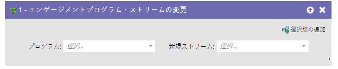
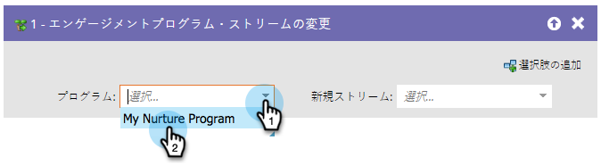
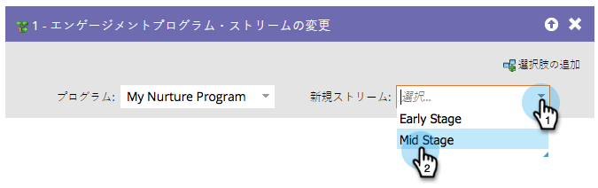

# エンゲージメントプログラムストリームの変更 {#change-engagement-program-stream}

通常、これを実現するには[ストリームトランジションルール](/help/marketo/product-docs/email-marketing/drip-nurturing/engagement-program-streams/transition-people-between-engagement-streams.md)を使用します。ただし、ユーザをあるストリームから別のストリームに手動で移動する場合は、このフローステップを使用します。

1. まず、人物を移動するエンゲージメントプログラムを選択します。

   >[!NOTE]
   >
   >別のプログラムを選択すると、その人物は現在のストリームに残り、新しいプログラムに追加されます。

   

1. 人物を追加するストリームを選択します。

   

これで完了です。
