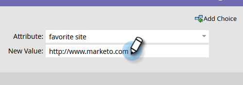

# プログラムメンバーの変更 {#change-program-member-data}

「データ値の変更」フローアクションを使用して、Marketo でフィールドの値を更新できます。

>[!NOTE]
>
>また、フィールドが更新されないようにブロックすることもできます。 詳細については、フィールドの更新をブロックを参照してください。

1. スマートキャンペーンの「フロー」タブで、「**[!UICONTROL プログラムメンバーデータの変更]**」フローステップを選択し、目的のプログラムを選択します。

   

1. 属性を変更するフィールド名を検索して選択します。

   

1. 必要な属性値を入力します。

   

>[!NOTE]
>
>「[!UICONTROL 新しい値]」にはトークンを使用できます。

準備ができたらスマートキャンペーンを実行します。

>[!TIP]
>
>フィールドを更新する代わりにクリアする場合は、「NULL」（引用符なし、すべての大文字）を[!UICONTROL 新しい値]として入力できます。

>[!MORELIKETHIS]
>
>* [フローステップでのトークンの使用](/help/marketo/product-docs/core-marketo-concepts/smart-campaigns/flow-actions/use-tokens-in-flow-steps.md){target="_blank"}
>* [フィールドへのデータ追加](/help/marketo/product-docs/core-marketo-concepts/smart-campaigns/flow-actions/append-data-to-a-field.md){target="_blank"}
