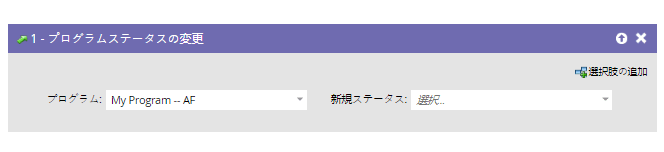
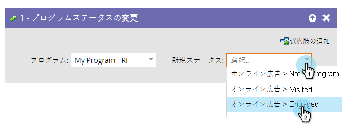

# プログラムステータスの変更 {#change-program-status}

## 概要 {#overview}

プログラムのステータスは、プログラムやイベント内での訪問者の進行状況を追跡するのに役立ちます。 詳しくは、「チャネルの [カスタマイズ、作成、管理](../../../../product-docs/administration/tags/create-a-program-channel.md)」を参照してください。

>[!CAUTION]
>
>エンゲージメントプログラムでプログラムステータスを変更すると、それらが自動的に最初のストリームに追加されます。 ユーザーはコンテンツの受信を開始します。

## 使用状況 {#usage}

1. 「 **プログラムステータスの** 変更」フローステップをドラッグします。

   

1. 設定する **新しいステータス** (New Status)を選択します。 まだプログラムに加わっていなければ、その人も会員になります。

   

選択肢は、そのプログラムで有効なステータスに制限されます。

>[!NOTE]
>
>管理者は、管理者のチャネルエディターで定義された以前のプログラムのステータスに戻すことはできません。

ステータスは、人の追跡やレポートを維持するための強力なツールです。 時間のかかる値打ちがある。