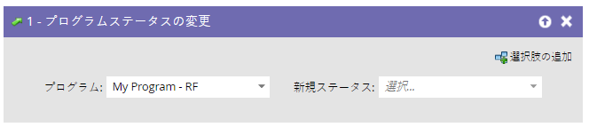
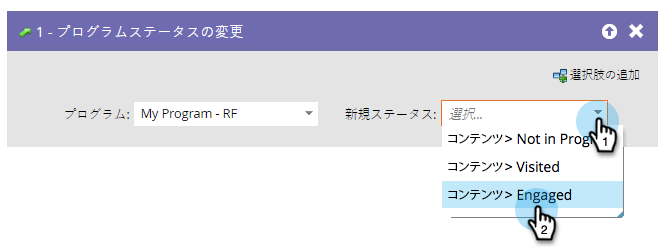

# プログラムステータスの変更 {#change-program-status}

プログラムのステータスは、プログラムやイベントの進行状況をトラックするのに役立ちます。詳しくは、[チャネルのカスタマイズ、作成、管理](/help/marketo/product-docs/administration/tags/create-a-program-channel.md){target="_blank"}を参照してください。

>[!CAUTION]
>
>エンゲージメントプログラム内のプログラムステータスを変更すると、最初のストリームに自動的に追加されます。コンテンツの受信が開始されます。

1. 「**[!UICONTROL プログラムステータスの変更]**」フローステップにドラッグします。

   

1. 設定する「**[!UICONTROL 新規ステータス]**」を選択します。また、その人物がまだメンバーになっていない場合は、そのプログラムのメンバーになります。

   

選択肢は、そのプログラムで有効なステータスに制限されます。

>[!NOTE]
>
>人物は、管理者のチャネルエディターで定義された以前のプログラムステータスに戻すことはできません。

ステータスは、人物を追跡し、レポートを作成する強力なツールです。
