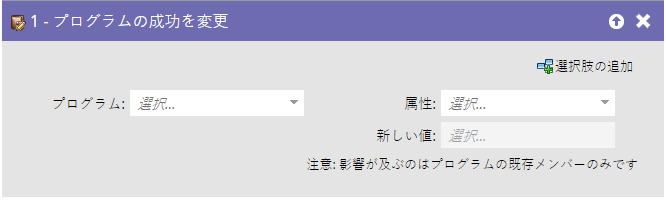
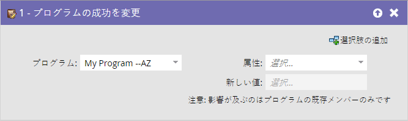
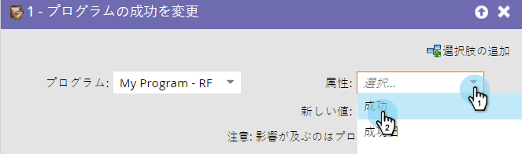
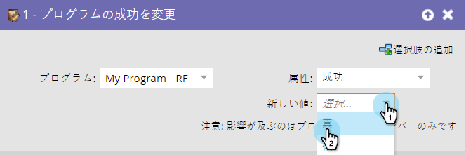

# 変更プログラムの成功 {#change-program-success}

## 概要 {#overview}

誤ってプログラム成功とマークされた人のグループが存在する場合は、このフロー手順を使用して、successをtrueまたはfalseに設定できます。

## 使用状況 {#usage}

1. このフローステップでドラッグすると、プログラムは、編集中のスマートキャンペーンが含まれるプログラムに自動的に設定されます。

   >[!NOTE]
   >
   >影響を受けるのは、プログラムのメンバーのみです。

   

1. 「属性」で「 **成功** 」または「成功日」を選択します。

   

   >[!NOTE]
   >
   >「成功日」を任意の値に設定すると、自動的に「成功」が「true」に設定されます。 「成功」を「true」に設定すると、成功日が現在の日付に自動的に設定されます。

1. 「 **新しい値** 」を「 **True** 」または「 **False**」に設定します。

   

   >[!TIP]
   >
   >フローステップを2回使用して、成功フラグと日付の両方を設定できます。

素晴らしい！ これで、元に戻して成功を強制する方法が分かります。