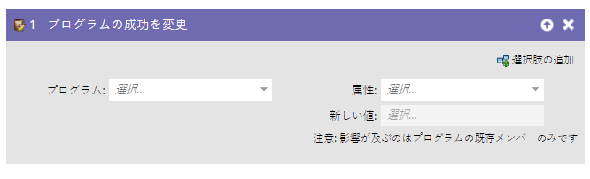
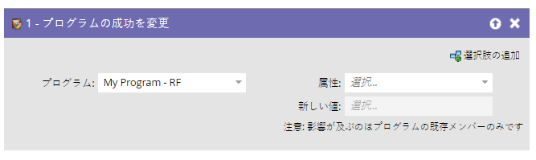
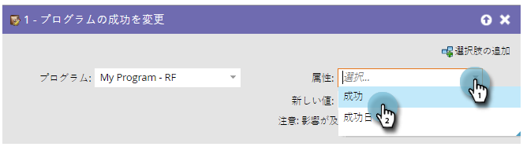
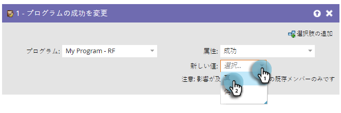

# プログラムの成功の変更 {#change-program-success}

誤ってプログラムの成功とマークされた人物のグループが存在する場合、このフローステップを使用して、プログラムの成功の true または false を設定できます。

1. このフローステップにドラッグしたプログラムは、編集中のスマートキャンペーンが含まれるプログラムに自動で設定されます。

   >[!NOTE]
   >
   >プログラムのメンバーのみに影響します。

   

1. 属性として「**[!UICONTROL 成功]**」か「**[!UICONTROL 成功日]**」を選択します。

   

   >[!NOTE]
   >
   >[!UICONTROL 成功日]に日付を設定すると、成功は自動的に「true」に設定されます。[!UICONTROL 成功]が「true」に設定されると、成功日は自動で現在の日付に設定されます。

1. 「**[!UICONTROL 新しい値]**」を **[!UICONTROL true]** か **[!UICONTROL false]** に設定します。

   

   >[!TIP]
   >
   >このフローステップを 2 回使用して、成功フラグならびに成功日の両方を設定することができます。

完了です。成功を解除・修正する方法を理解できました。
