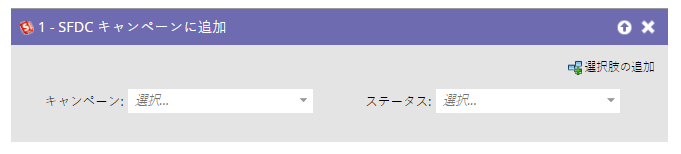
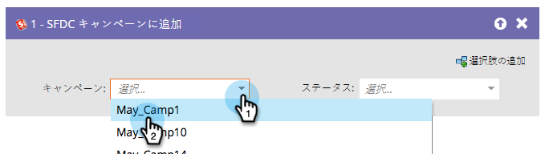
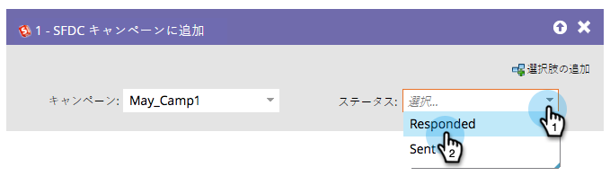

# SFDC キャンペーンに追加 {#add-to-sfdc-campaign}

Marketo Engage キャンペーンでこのフローステップを使用できます。または、単独のフローステップとして使用して、Salesforce キャンペーンで人物をリードとして追加できます。 リードがまだ Salesforce 内に存在していない場合、自動的に同期が行われ、指定されたステータスを付与してキャンペーンに追加されます。

>[!NOTE]
>
>[!DNL Salesforce] と統合されている場合にのみ使用できます。

## 使用方法 {#usage}

1. リードを追加する [!DNL Salesforce] のキャンペーンを見つけて選択します。

   

   >[!TIP]
   >
   >キャンペーンリストにSalesforce キャンペーンが表示されない場合：
   >
   > 1. [&#x200B; キャンペーン同期が有効になっていることを確認します](/help/marketo/product-docs/crm-sync/salesforce-sync/setup/optional-steps/enable-disable-campaign-sync.md){target="_blank"}。
   > 1. [Marketo 同期ユーザー](/help/marketo/product-docs/crm-sync/salesforce-sync/setup/enterprise-unlimited-edition/step-2-of-3-create-a-salesforce-user-for-marketo-enterprise-unlimited.md){target="_blank"}が、Salesforce で[マーケティングユーザー](/help/marketo/product-docs/crm-sync/salesforce-sync/setup/optional-steps/enable-disable-campaign-sync/make-marketo-sync-user-a-marketing-user.md){target="_blank"}になっていることを確認します。

   >[!TIP]
   >
   >Salesforce のキャンペーンの[マイトークン](/help/marketo/product-docs/core-marketo-concepts/programs/tokens/managing-my-tokens.md){target="_blank"}を用いて指定すれば、プログラムを簡単に複製できます。

1. [!DNL Salesforce] のキャンペーンにリードが追加されたときに割り当てるメンバーステータスを選択します。

   

   >[!CAUTION]
   >
   >リードが既に Salesforce のキャンペーンのメンバーである場合、この処理は省略され、ステータスは更新されません。 代わりに、[SFDC キャンペーン内のステータスの変更](/help/marketo/product-docs/core-marketo-concepts/smart-campaigns/salesforce-flow-actions/change-status-in-sfdc-campaign.md){target="_blank"}を使用して、ステータスを変更できます。
