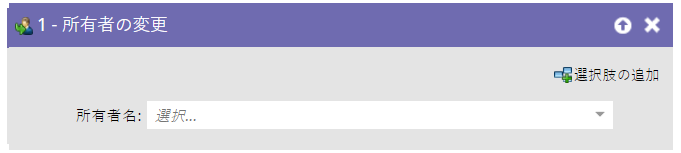
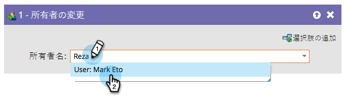

# 所有者の変更 {#change-owner}

このフローステップを使用して、既に所有者に割り当てられている人物を別の所有者に再割り当てできます。

1. 変更する所有者もしくはリードのキューを選択します。

   

   >[!CAUTION]
   >
   >[!DNL Salesforce] では取引先責任者をリードのキューに割り当てることはできません。 SFDC 取引先責任者のレコードの場合：
   >
   >* Marketo は、取引先責任者が Salesforce に同期された&#x200B;**場合のみ**、リードを重複して作成します。 つまり、**[リードを SFDC に同期](/help/marketo/product-docs/core-marketo-concepts/smart-campaigns/salesforce-flow-actions/sync-person-to-sfdc.md)**&#x200B;フローステップを `AssignTo=<a lead queue>` と共に使用すると、Marketo は Salesforce で重複したリードを作成し、リードキューに割り当てます。
   >
   >* 取引先責任者に&#x200B;**[!UICONTROL 所有者を変更]**&#x200B;フローステップを使用すると、Marketo は Salesforce に重複したリードを作成します。 この問題を回避するには、「SFDC タイプ」フィールドで、アクションをリードのみに制限するフィルターを使用します。

   >[!NOTE]
   >
   >レコードが [!DNL Salesforce] アカウントにまだ存在しない場合は、レコードが同期され、選択したユーザに割り当てられます。
