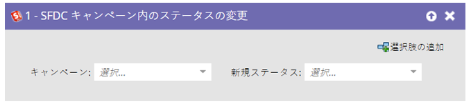
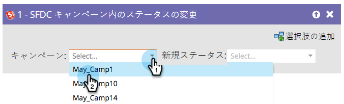
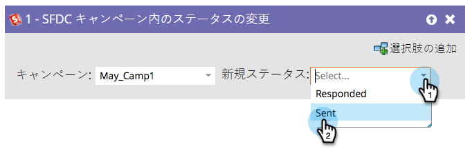

# SFDC キャンペーンでのステータス変更 {#change-status-in-sfdc-campaign}

このフローステップでは、リードの Salesforce キャンペーンメンバーステータスを変更できます。

>[!NOTE]
>
>[!DNL Salesforce] と統合されている場合にのみ使用できます。

リードが Salesforce に存在しない場合、またはまだキャンペーンのメンバーでない場合は、自動的に同期され、適切なステータスで Salesforce キャンペーンに追加されます。

1. 最初に、レコードが含まれている Salesforce **[!UICONTROL キャンペーン]**&#x200B;を検索して選択します。

   

1. 設定する「**[!UICONTROL 新規ステータス]**」を選択したら完了です。

   
